# GatewayZ API — Endpoint Reference (Top 20)

> **Base URL**: `https://api.gatewayz.ai`
> **Authentication**: `Authorization: Bearer <api-key>` — keys begin with `gw_live_`, `gw_test_`, `gw_staging_`, or `gw_dev_`
> **Admin Auth**: `Authorization: Bearer sk_admin_live_<key>` for admin endpoints
> **Content-Type**: `application/json` unless noted
> **Version**: March 2026

---

## Table of Contents

1. [POST /v1/chat/completions](#1-post-v1chatcompletions) — AI inference (OpenAI-compatible)
2. [POST /v1/responses](#2-post-v1responses) — Unified responses API
3. [POST /v1/messages](#3-post-v1messages) — Anthropic Claude-compatible
4. [GET /v1/models](#4-get-v1models) — List all models
5. [POST /v1/images/generations](#5-post-v1imagesgenerations) — Image generation
6. [POST /v1/audio/transcriptions](#6-post-v1audiotranscriptions) — Audio transcription
7. [POST /auth](#7-post-auth) — User login (Privy)
8. [POST /auth/register](#8-post-authregister) — New user registration
9. [GET /user/balance](#9-get-userbalance) — Credit balance
10. [GET /user/profile](#10-get-userprofile) — User profile
11. [GET /health](#11-get-health) — Gateway liveness
12. [GET /v1/status/providers](#12-get-v1statusproviders) — Provider status
13. [GET /admin/users](#13-get-adminusers) — Admin: list users
14. [POST /admin/add_credits](#14-post-adminadd_credits) — Admin: add credits
15. [GET /admin/monitor](#15-get-adminmonitor) — Admin: system monitoring
16. [GET /admin/trial/analytics](#16-get-admintrialanalytics) — Trial analytics
17. [GET /v1/models](#17-get-v1models-extended) — Full model catalog (extended parameters)
18. [GET /api/monitoring/latency/{provider}/{model}](#18-get-apimonitoringlatencyprovidermodel) — Latency metrics
19. [GET /admin/cache-status](#19-get-admincache-status) — Cache health
20. [GET /general-router/models](#20-get-general-routermodels) — Router model list

---

## Middleware Pipeline

Every request to GatewayZ passes through a layered middleware stack (outermost to innermost). Based on the actual middleware modules in `src/middleware/`:

| Layer | Middleware | Purpose |
|-------|-----------|---------|
| 1 | Security | IP rate limiting, bot detection, threat blocking (velocity mode, 300 RPM authenticated / 60 RPM anonymous) |
| 2 | Timeout | Hard deadline on all requests (prevents event-loop blocking) |
| 3 | Concurrency | Admission control — prevents overload via request prioritization |
| 4 | Request ID | Injects `X-Request-ID` correlation header |
| 5 | Trace Context | OpenTelemetry distributed tracing propagation |
| 6 | AutoSentry | Automatic error capture and reporting via `src/utils/auto_sentry.py` |
| 7 | CORS | Cross-origin request handling |
| 8 | Observability | Prometheus metrics collection (`src/middleware/observability_middleware.py`) |
| 9 | GZip | Selective response compression |

Three-layer rate limiting architecture (implemented February 2025, issue #1091):
- **Layer 1**: `src/middleware/security_middleware.py` — IP-level and behavioral rate limiting
- **Layer 2**: `src/services/rate_limiting.py` — Per-API-key, Redis-backed enforcement
- **Layer 3**: `src/services/anonymous_rate_limiter.py` — Anonymous user rate limiting with allowed-model restrictions

---

## 1. POST /v1/chat/completions

### What & Why (Plain English)

This is the core endpoint of GatewayZ — every AI text generation request flows through here. When a developer sends a message to be answered by an AI model (GPT-4o, Claude Sonnet, Gemini, Llama, or any of 100+ models), this endpoint receives it, authenticates the caller, checks their credit balance, routes the request to the selected AI provider, streams or returns the response, and records usage. It exists to provide a single, OpenAI-compatible entry point so that any application already using the OpenAI SDK works with GatewayZ without code changes — just swap the base URL.

**Who calls it**: Any client application making AI requests — web apps, mobile apps, API integrations, developer tools, code editors. This is the highest-traffic endpoint in the system.

**Outcome**: Returns an AI-generated response in OpenAI `ChatCompletion` format, either as a single JSON object or as a real-time stream of Server-Sent Events (SSE).

---

### Auth & Access

| Field | Value |
|-------|-------|
| **Authentication** | Bearer API key (`gw_live_*`, `gw_test_*`, `gw_staging_*`, `gw_dev_*`) |
| **Admin bypass** | Admin keys via `require_admin` dependency skip user-level rate limits |
| **Anonymous access** | Limited — `get_optional_api_key` used; anonymous users restricted to `ANONYMOUS_ALLOWED_MODELS` |
| **Rate Limiting** | Three-layer: IP security middleware + per-key Redis rate limiting + anonymous limiter |
| **Trial users** | Validated via `validate_trial_access()` in `src/services/trial_validation.py`; 429 returned when exhausted |
| **Public** | No — API key required for full access |

---

### Request Schema

**Content-Type**: `application/json`

Schema defined in `src/schemas/` as `ProxyRequest`:

| Field | Type | Required | Description |
|-------|------|----------|-------------|
| `model` | string | Yes | Model identifier — e.g. `"openrouter/openai/gpt-4o"`, `"anthropic/claude-sonnet-4"`, `"google-vertex/gemini-pro-1.5"`, `"groq/llama-3.3-70b-versatile"` |
| `messages` | array | Yes | Conversation history. Each item: `{"role": "user"|"assistant"|"system", "content": string}` |
| `stream` | boolean | No | `true` = SSE streaming response, `false` = wait for full response. Default: `false` |
| `max_tokens` | integer | No | Maximum tokens in the response. Provider-dependent default if omitted. Gemini models enforce minimum of 16 |
| `temperature` | float | No | Randomness 0.0–2.0. Lower = more deterministic. Default: `1.0` |
| `top_p` | float | No | Nucleus sampling probability. Default: `1.0` |
| `tools` | array | No | Tool/function definitions for function calling. OpenAI tools format |
| `tool_choice` | string/object | No | `"auto"`, `"none"`, or `{"type": "function", "function": {"name": "..."}}` |
| `frequency_penalty` | float | No | -2.0 to 2.0. Reduces repetition |
| `presence_penalty` | float | No | -2.0 to 2.0. Increases topic diversity |
| `stop` | string/array | No | Stop sequence(s) |
| `user` | string | No | Caller-defined user identifier for abuse tracking |

---

### Response Schema

**Non-streaming** (`stream: false`):
```json
{
  "id": "chatcmpl-abc123",
  "object": "chat.completion",
  "created": 1709123456,
  "model": "openrouter/openai/gpt-4o",
  "choices": [{
    "index": 0,
    "message": {"role": "assistant", "content": "..."},
    "finish_reason": "stop"
  }],
  "usage": {
    "prompt_tokens": 42,
    "completion_tokens": 128,
    "total_tokens": 170
  }
}
```

**Streaming** (`stream: true`): Server-Sent Events processed through `StreamNormalizer` in `src/services/stream_normalizer.py`. Each SSE line prefixed `data: `, terminated by `data: [DONE]`.

---

### Error Responses

| Code | Meaning |
|------|---------|
| `400` | Invalid request schema or unsupported model |
| `401` | Missing or invalid API key |
| `402` | Insufficient credits — top up required |
| `429` | Rate limit exceeded (RPM or daily token budget) |
| `500` | Provider error or internal failure |
| `503` | Provider client failed to load or all providers unavailable |

---

### Request Lifecycle (Mermaid)

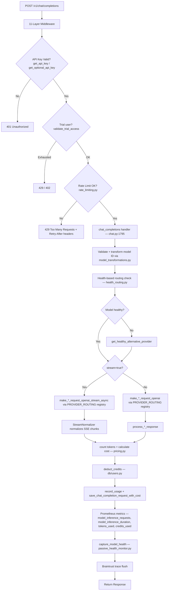

---

### Dependency Map

| Dependency | Type | Module | Purpose |
|-----------|------|--------|---------|
| `get_api_key` | Auth | `src/security/deps.py` | Validates Bearer token, returns user context |
| `get_optional_api_key` | Auth | `src/security/deps.py` | Optional auth — permits anonymous limited access |
| `validate_anonymous_request` | Auth | `src/services/anonymous_rate_limiter.py` | Anonymous user model restrictions |
| `validate_trial_access` | Trial | `src/services/trial_validation.py` | Trial credit/request budget enforcement |
| `get_rate_limit_manager` | Rate Limit | `src/services/rate_limiting.py` | Redis-backed per-key RPM + token budget |
| `detect_provider_from_model_id` | Routing | `src/services/model_transformations.py` | Parses provider from model string |
| `transform_model_id` | Routing | `src/services/model_transformations.py` | Normalizes model ID for provider API |
| `is_model_healthy` / `should_use_health_based_routing` | Health | `src/services/health_routing.py` | Proactive failover decisions |
| `get_healthy_alternative_provider` | Failover | `src/services/health_routing.py` | Selects healthy alternative on degradation |
| `build_provider_failover_chain` | Failover | `src/services/provider_failover.py` | Ordered failover chain construction |
| `PROVIDER_ROUTING` | Registry | `src/routes/chat.py` | 30-provider registry mapping names to client functions |
| `make_openrouter_request_openai` | Provider | `src/services/openrouter_client.py` | OpenRouter API call (primary multi-model) |
| `make_groq_request_openai` | Provider | `src/services/groq_client.py` | Groq API call |
| `make_cerebras_request_openai` | Provider | `src/services/cerebras_client.py` | Cerebras API call |
| `StreamNormalizer` | Streaming | `src/services/stream_normalizer.py` | Normalizes SSE chunks across providers |
| `track_time_to_first_chunk` | Metrics | `src/services/prometheus_metrics.py` | TTFT Prometheus histogram |
| `calculate_cost_async` | Pricing | `src/services/pricing.py` | Async cost calculation |
| `deduct_credits` | DB Write | `src/db/users.py` | Atomic credit deduction |
| `record_usage` | DB Write | `src/db/users.py` | Logs token counts + cost to Supabase |
| `save_chat_completion_request_with_cost` | DB Write | `src/db/chat_completion_requests_enhanced.py` | Full request record with cost |
| `model_inference_requests` | Metrics | `src/services/prometheus_metrics.py` | Prometheus request counter |
| `model_inference_duration` | Metrics | `src/services/prometheus_metrics.py` | Latency histogram |
| `tokens_used` | Metrics | `src/services/prometheus_metrics.py` | Token usage counter |
| `credits_used` | Metrics | `src/services/prometheus_metrics.py` | Credit spend counter |
| `capture_model_health` | Health | `src/services/passive_health_monitor.py` | Updates provider health on response |
| `AITracer` | Tracing | `src/utils/ai_tracing.py` | OpenTelemetry + Braintrust tracing |
| `capture_provider_error` | Observability | `src/utils/sentry_context.py` | Sentry error capture |
| `get_butter_pooled_async_client` | Performance | `src/services/connection_pool.py` | Butter.dev connection pool for caching |
| `set_traceloop_properties` | Tracing | `src/config/traceloop_config.py` | Traceloop span association (optional) |

---

### Side Effects

- **Credit deduction**: User's credit balance decremented via `deduct_credits()` in `src/db/users.py`
- **Usage recorded**: Full request record inserted into `chat_completion_requests` table via `save_chat_completion_request_with_cost()`
- **Prometheus counters**: `model_inference_requests`, `model_inference_duration`, `tokens_used`, `credits_used`, and `track_time_to_first_chunk` all updated
- **Provider health**: Success/failure recorded via `capture_model_health()` to `passive_health_monitor`, affects future `health_routing.py` decisions
- **Braintrust trace**: LLM trace flushed via `braintrust_flush()` if Braintrust is configured
- **OpenTelemetry trace**: Full distributed trace via `AITracer` with `AIRequestType` span classification
- **Sentry capture**: Provider errors reported via `capture_provider_error()` with provider context
- **Trial usage tracking**: `track_trial_usage()` called for trial users to update `trial_used_tokens` / `trial_used_requests`
- **Anonymous request recording**: `record_anonymous_request()` increments anonymous user counters in Redis
- **API key usage**: `increment_api_key_usage()` called on the `api_keys_new` table

---

## 2. POST /v1/responses

### What & Why (Plain English)

The unified responses endpoint is GatewayZ's implementation of the OpenAI Responses API format — a newer, more flexible alternative to chat completions. It accepts the same models and message formats but uses the `ResponseRequest` schema (defined in `src/schemas/`) with an `input` field instead of `messages`, and returns responses in the OpenAI Responses API envelope format (`object: "response"`, output as typed blocks). It exists for clients that have adopted the newer OpenAI Python SDK (v1.x+) patterns and expect `POST /v1/responses` to work identically to how it does with OpenAI directly.

**Who calls it**: Applications using the latest OpenAI Python SDK or TypeScript SDK that switched to the new responses format. Less common than `/v1/chat/completions` but growing.

**Outcome**: Returns a structured AI response object in OpenAI Responses API format, with support for streaming.

---

### Auth & Access

| Field | Value |
|-------|-------|
| **Authentication** | Bearer API key (`gw_live_*`, `gw_test_*`) |
| **Rate Limiting** | Same three-layer pipeline as `/v1/chat/completions` |
| **Handler** | `unified_responses()` — `src/routes/chat.py:3621` |
| **Public** | No |

---

### Request Schema

Schema defined as `ResponseRequest` in `src/schemas/`:

| Field | Type | Required | Description |
|-------|------|----------|-------------|
| `model` | string | Yes | Model ID — same format as chat completions |
| `input` | string/array | Yes | User input — string or array of message objects |
| `instructions` | string | No | System-level instructions (equivalent to system message) |
| `stream` | boolean | No | Enable SSE streaming |
| `tools` | array | No | Tool definitions |
| `tool_choice` | string | No | Tool selection strategy |
| `max_output_tokens` | integer | No | Max response tokens |
| `temperature` | float | No | 0.0–2.0 |

---

### Response Schema

```json
{
  "id": "resp_abc123",
  "object": "response",
  "created_at": 1709123456,
  "model": "openrouter/openai/gpt-4o",
  "output": [{"type": "message", "content": [{"type": "output_text", "text": "..."}]}],
  "usage": {"input_tokens": 42, "output_tokens": 128, "total_tokens": 170}
}
```

---

### Error Responses

Same as `/v1/chat/completions` (400, 401, 402, 429, 500, 503).

---

### Request Lifecycle (Mermaid)

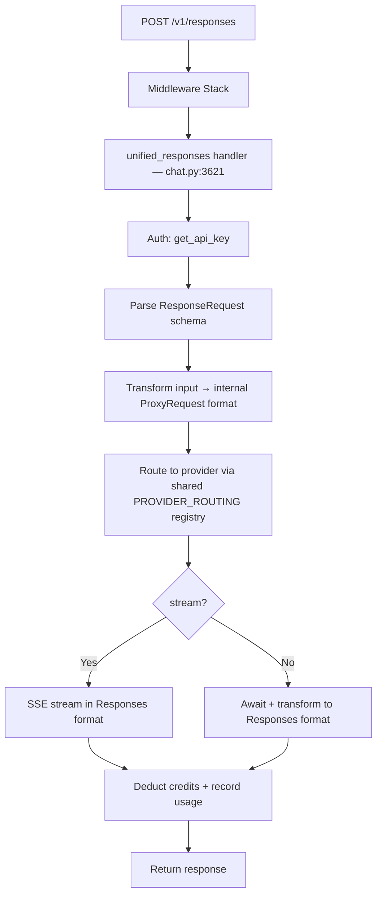

---

### Dependency Map

| Dependency | Type | Module | Purpose |
|-----------|------|--------|---------|
| `get_api_key` | Auth | `src/security/deps.py` | API key validation |
| `ResponseRequest` | Schema | `src/schemas/` | Request validation |
| `PROVIDER_ROUTING` | Registry | `src/routes/chat.py` | Shared provider client registry |
| `StreamNormalizer` | Streaming | `src/services/stream_normalizer.py` | SSE normalization |
| `deduct_credits` | DB Write | `src/db/users.py` | Credit deduction |
| `record_usage` | DB Write | `src/db/users.py` | Usage logging |
| `model_inference_requests` | Metrics | `src/services/prometheus_metrics.py` | Prometheus counters |

---

### Side Effects

Same as `/v1/chat/completions`: credit deduction, usage recording, Prometheus metrics, provider health update via `capture_model_health()`.

---

## 3. POST /v1/messages

### What & Why (Plain English)

This endpoint mirrors Anthropic's Claude Messages API exactly — for developers who use the official Anthropic Python or TypeScript SDK and want to route their requests through GatewayZ instead of directly to Anthropic. The endpoint accepts Anthropic-formatted requests (with `max_tokens` required, `system` as a top-level field, content as typed blocks), converts them to the internal format using `src/services/anthropic_transformer.py`, forwards them to the appropriate provider, and returns an Anthropic-compatible response. This matters because it lets teams switch to GatewayZ's multi-provider routing and cost management without rewriting a single line of client code.

**Who calls it**: Applications built with `import anthropic` using `client.messages.create()`. Also called by Claude-specific tooling and apps.

**Outcome**: Returns an Anthropic `Message` response object with `content` blocks.

---

### Auth & Access

| Field | Value |
|-------|-------|
| **Authentication** | Bearer API key (`gw_live_*`) via `get_api_key` dependency |
| **Rate Limiting** | Three-layer rate limiting — same as chat completions |
| **Trial Validation** | `validate_trial_access()` + `track_trial_usage()` called |
| **Handler** | Defined in `src/routes/messages.py` |
| **Public** | No |

---

### Request Schema

Schema defined as `MessagesRequest` in `src/schemas/`:

| Field | Type | Required | Description |
|-------|------|----------|-------------|
| `model` | string | Yes | Model ID — e.g. `"anthropic/claude-sonnet-4"`, `"claude-3-5-sonnet-20241022"` |
| `messages` | array | Yes | `[{"role": "user"|"assistant", "content": string|array}]` |
| `max_tokens` | integer | Yes | **Required** in Anthropic format. Max output tokens |
| `system` | string | No | System prompt (top-level, not inside messages) |
| `stream` | boolean | No | `true` for SSE streaming |
| `temperature` | float | No | 0.0–1.0 |
| `top_p` | float | No | Nucleus sampling |
| `top_k` | integer | No | Top-K sampling |
| `tools` | array | No | Anthropic tool definitions |
| `tool_choice` | object | No | `{"type": "auto"|"any"|"tool", "name": "..."}` |

---

### Response Schema

```json
{
  "id": "msg_abc123",
  "type": "message",
  "role": "assistant",
  "content": [{"type": "text", "text": "..."}],
  "model": "claude-sonnet-4-20260101",
  "stop_reason": "end_turn",
  "stop_sequence": null,
  "usage": {"input_tokens": 42, "output_tokens": 128}
}
```

---

### Error Responses

| Code | Meaning |
|------|---------|
| `400` | Missing `max_tokens` or invalid schema |
| `401` | Invalid API key |
| `402` | Insufficient credits |
| `529` | Anthropic overloaded (proxied from provider) |

---

### Request Lifecycle (Mermaid)

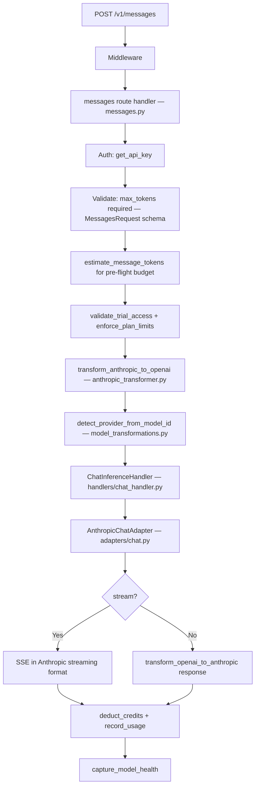

---

### Dependency Map

| Dependency | Type | Module | Purpose |
|-----------|------|--------|---------|
| `get_api_key` | Auth | `src/security/deps.py` | API key validation |
| `MessagesRequest` | Schema | `src/schemas/` | Anthropic-format request validation |
| `transform_anthropic_to_openai` | Transform | `src/services/anthropic_transformer.py` | Format conversion |
| `transform_openai_to_anthropic` | Transform | `src/services/anthropic_transformer.py` | Response format conversion |
| `extract_text_from_content` | Transform | `src/services/anthropic_transformer.py` | Content block text extraction |
| `ChatInferenceHandler` | Handler | `src/handlers/chat_handler.py` | Unified inference dispatch |
| `AnthropicChatAdapter` | Adapter | `src/adapters/chat.py` | Anthropic protocol adapter |
| `detect_provider_from_model_id` | Routing | `src/services/model_transformations.py` | Provider detection |
| `estimate_message_tokens` | Util | `src/utils/token_estimator.py` | Pre-flight token estimation |
| `validate_trial_access` | Trial | `src/services/trial_validation.py` | Trial enforcement |
| `record_model_call` | Health | `src/db/model_health.py` | Model health recording |
| `capture_model_health` | Health | `src/services/passive_health_monitor.py` | Passive health monitoring |
| `get_rate_limit_manager` | Rate Limit | `src/services/rate_limiting.py` | Redis rate limiting |
| `deduct_credits` | DB Write | `src/db/users.py` | Credit deduction |
| `record_usage` | DB Write | `src/db/users.py` | Usage logging |

---

### Side Effects

Credit deduction, usage recording, `record_model_call()` to `model_health` table, Prometheus metrics (`model_inference_requests`), `capture_model_health()` for passive health monitoring, Sentry tracing on error via `capture_provider_error()`.

---

## 4. GET /v1/models

### What & Why (Plain English)

This endpoint returns the full list of AI models available through GatewayZ. Every client application calls this on startup or when building a model picker UI — it is the discovery endpoint that tells callers what models they can use. The list aggregates models from 30+ providers (OpenAI, Anthropic, Google Vertex, Groq, Cerebras, Featherless, Together, Fireworks, HuggingFace, and many more), with support for gateway filtering, pagination, and optionally enriched Hugging Face metadata. The response is served from an in-memory cache and is keyed by the `get_cached_models()` service function.

**Who calls it**: Admin dashboards, developer tools, client applications building model selection UIs, and any integration that needs to know what models are available.

**Outcome**: A JSON array of model objects compatible with OpenAI `Model` format, with GatewayZ extensions for gateway, provider, and pricing metadata.

---

### Auth & Access

| Field | Value |
|-------|-------|
| **Authentication** | None required — public endpoint |
| **Rate Limiting** | Light; response served from in-memory cache (`get_cached_models()`) |
| **Handler** | `get_all_models()` — `src/routes/catalog.py:2287` |
| **Router prefix** | Mounted under `/v1` → full path is `/v1/models` |
| **Backwards compat** | Also available at root `/models` (added by `main.py:617`) |
| **Public** | Yes |

---

### Request Schema

| Parameter | Type | Required | Description |
|-----------|------|----------|-------------|
| `provider` | query string | No | Filter models by provider slug — e.g. `?provider=openai` |
| `is_private` | query boolean | No | `true` = private only, `false` = non-private only, null = all |
| `limit` | query integer | No | Results per page (1–1000, default: 100) |
| `offset` | query integer | No | Pagination offset (default: 0) |
| `include_huggingface` | query boolean | No | `true` to enrich models with Hugging Face metrics (slower). Default: `false` |
| `gateway` | query string | No | Gateway filter: `"openrouter"`, `"groq"`, `"featherless"`, `"together"`, `"fireworks"`, `"cerebras"`, `"chutes"`, `"huggingface"`, etc., or `"all"` (default). See `GATEWAY_REGISTRY` in `catalog.py` for full list |
| `unique_models` | query boolean | No | When `true` and `gateway="all"`, deduplicates models with provider arrays. Default: `false` |

---

### Response Schema

```json
{
  "object": "list",
  "data": [
    {
      "id": "openrouter/openai/gpt-4o",
      "object": "model",
      "created": 1709000000,
      "owned_by": "openai",
      "context_length": 128000,
      "source_gateway": "openrouter",
      "provider_slug": "openrouter",
      "pricing": {
        "prompt": "0.0025",
        "completion": "0.01"
      }
    }
  ]
}
```

When `unique_models=true`:
```json
{
  "data": [
    {
      "id": "gpt-4o",
      "providers": [
        {"slug": "openrouter", "pricing": {...}},
        {"slug": "vercel-ai-gateway", "pricing": {...}}
      ]
    }
  ]
}
```

---

### Request Lifecycle (Mermaid)

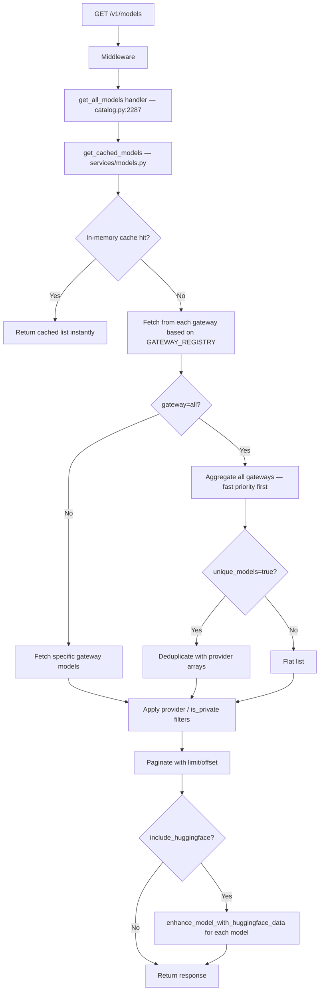

---

### Dependency Map

| Dependency | Type | Module | Purpose |
|-----------|------|--------|---------|
| `get_cached_models` | Service | `src/services/models.py` | In-memory model catalog cache |
| `enhance_model_with_huggingface_data` | Service | `src/services/models.py` | HuggingFace enrichment |
| `enhance_model_with_provider_info` | Service | `src/services/models.py` | Provider metadata enrichment |
| `get_model_count_by_provider` | Service | `src/services/models.py` | Per-provider model counts |
| `normalize_provider_slug` | Service | `src/services/models.py` | Provider slug normalization |
| `GATEWAY_REGISTRY` | Config | `src/routes/catalog.py` | Canonical gateway registry |
| `set_gateway_model_count` | Metrics | `src/services/prometheus_metrics.py` | Prometheus gauge for model counts |
| `get_cached_providers` | Service | `src/services/providers.py` | Provider metadata lookup |

---

### Side Effects

None — read-only. May trigger HuggingFace API calls when `include_huggingface=true`.

---

## 5. POST /v1/images/generations

### What & Why (Plain English)

This endpoint generates images from text descriptions using AI image models — Stable Diffusion (via DeepInfra), Flux (via Fal.ai), Imagen (via Google Vertex), and others. You send a text prompt and parameters (size, number of images), and GatewayZ routes the request to the appropriate image generation provider, calculates the cost based on resolution and model using a tiered pricing system (first checking `manual_pricing.json`, then hardcoded fallback), deducts credits, and returns image URLs. It is compatible with the OpenAI image generation API.

**Who calls it**: Applications with image generation features — content creation tools, design assistants, marketing platforms, any app generating visual content programmatically.

**Outcome**: Returns one or more image URLs (or base64 data if supported).

---

### Auth & Access

| Field | Value |
|-------|-------|
| **Authentication** | Bearer API key via `get_api_key` |
| **Rate Limiting** | Per-key RPM (images are compute-intensive) |
| **Handler** | Defined in `src/routes/images.py` |
| **Router prefix** | Mounted under `/v1` → full path is `/v1/images/generations` |
| **Public** | No |

---

### Request Schema

Schema defined in `src/models/image_models.py` as `ImageGenerationRequest`:

| Field | Type | Required | Description |
|-------|------|----------|-------------|
| `model` | string | Yes | Image model — e.g. `"fal-ai/flux/schnell"`, `"fal-ai/flux/dev"`, `"fal-ai/flux-pro"`, `"deepinfra/stable-diffusion-3.5-large"`, `"deepinfra/stable-diffusion-3.5-medium"`, `"google-vertex/imagen-3.0-generate-001"` |
| `prompt` | string | Yes | Text description of the image to generate |
| `n` | integer | No | Number of images (1–10). Default: 1 |
| `size` | string | No | `"256x256"`, `"512x512"`, `"1024x1024"` (base rate), `"1024x1792"` (1.5x), `"1792x1024"` (1.5x), `"2048x2048"` (2x). Default: `"1024x1024"` |
| `response_format` | string | No | `"url"` (default) or `"b64_json"` |
| `user` | string | No | Caller user identifier |

---

### Response Schema

Schema defined as `ImageGenerationResponse` in `src/models/image_models.py`:

```json
{
  "created": 1709123456,
  "data": [
    {"url": "https://...generated-image-url..."}
  ]
}
```

---

### Error Responses

| Code | Meaning |
|------|---------|
| `400` | Invalid size/provider combination |
| `401` | Invalid API key |
| `402` | Insufficient credits (image generation has higher credit cost) |
| `429` | Rate limit exceeded |
| `500` | Provider image generation failure |

---

### Request Lifecycle (Mermaid)

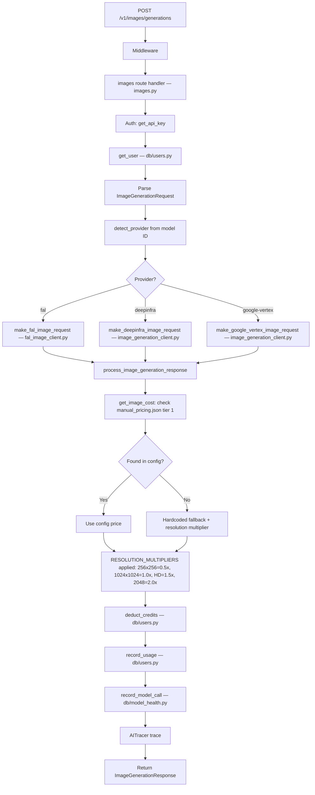

---

### Dependency Map

| Dependency | Type | Module | Purpose |
|-----------|------|--------|---------|
| `get_api_key` | Auth | `src/security/deps.py` | Auth validation |
| `get_user` | DB | `src/db/users.py` | User record lookup |
| `ImageGenerationRequest` | Schema | `src/models/image_models.py` | Request validation |
| `ImageGenerationResponse` | Schema | `src/models/image_models.py` | Response type |
| `make_fal_image_request` | Provider | `src/services/fal_image_client.py` | Fal.ai image generation (Flux) |
| `make_deepinfra_image_request` | Provider | `src/services/image_generation_client.py` | DeepInfra image generation (SD 3.5) |
| `make_google_vertex_image_request` | Provider | `src/services/image_generation_client.py` | Google Vertex Imagen |
| `process_image_generation_response` | Provider | `src/services/image_generation_client.py` | Response normalization |
| `get_image_pricing` | Pricing | `src/services/pricing_lookup.py` | Tier-1 config-driven pricing |
| `get_image_cost` | Pricing | `src/routes/images.py` | Resolution-aware cost calculation |
| `RESOLUTION_MULTIPLIERS` | Config | `src/routes/images.py` | Resolution cost multipliers |
| `deduct_credits` | DB Write | `src/db/users.py` | Atomic credit deduction |
| `record_usage` | DB Write | `src/db/users.py` | Usage tracking |
| `increment_api_key_usage` | DB Write | `src/db/api_keys.py` | API key counter increment |
| `record_model_call` | Health | `src/db/model_health.py` | Model health tracking |
| `AITracer` | Tracing | `src/utils/ai_tracing.py` | OpenTelemetry tracing |
| `PerformanceTracker` | Perf | `src/utils/performance_tracker.py` | Latency measurement |

---

### Side Effects

Credit deduction (resolution-aware, higher rate than text — cost varies from $0.003/image for Flux Schnell to $0.05/image for Flux Pro), usage recorded, `record_model_call()` to `model_health` table, Prometheus counters updated.

---

## 6. POST /v1/audio/transcriptions

### What & Why (Plain English)

This endpoint transcribes audio files to text using OpenAI's Whisper model or Simplismart-compatible alternatives. You upload an audio file (MP3, WAV, M4A, OGG, WEBM, FLAC, etc.) via multipart form data and receive back a text transcription. GatewayZ makes this endpoint compatible with the OpenAI Whisper API so existing audio transcription integrations work without modification. Credits are billed per minute of audio — when the actual duration is not available from the API response, duration is estimated from file size using format-specific bytes-per-minute estimates (1MB/min for compressed formats, 10MB/min for WAV, 5MB/min for FLAC).

**Who calls it**: Applications with voice input features — meeting transcription tools, voice assistants, podcast processors, accessibility tools.

**Outcome**: Returns the transcribed text as a string, with optional word-level timestamps in `verbose_json` mode.

---

### Auth & Access

| Field | Value |
|-------|-------|
| **Authentication** | Bearer API key via `get_api_key` |
| **Rate Limiting** | Per-key RPM (compute-heavy) |
| **Content-Type** | `multipart/form-data` (file upload) |
| **Max file size** | 25MB (Whisper's limit) |
| **Router prefix** | Mounted under `/v1/audio` (`prefix="/audio"` in `audio.py`) → full path is `/v1/audio/transcriptions` |
| **Public** | No |

---

### Request Schema

| Field | Type | Required | Description |
|-------|------|----------|-------------|
| `file` | UploadFile | Yes | Audio file. Supported: `audio/flac`, `audio/m4a`, `audio/mp3`, `audio/mpeg`, `audio/mpga`, `audio/mp4`, `audio/ogg`, `audio/wav`, `audio/webm`. Max 25MB |
| `model` | string | Yes | Transcription model — `"whisper-1"` ($0.006/min) or `"whisper-large-v3"` ($0.006/min) |
| `language` | string | No | ISO 639-1 language code — e.g. `"en"`, `"es"`. Auto-detected if omitted |
| `prompt` | string | No | Context hint to improve transcription accuracy |
| `response_format` | string | No | `"json"` (default), `"text"`, `"srt"`, `"verbose_json"`, `"vtt"` |
| `temperature` | float | No | 0.0–1.0 sampling temperature |

---

### Response Schema

```json
{"text": "The transcribed audio content goes here."}
```
Or `verbose_json` format with word-level timestamps and segment details.

---

### Request Lifecycle (Mermaid)

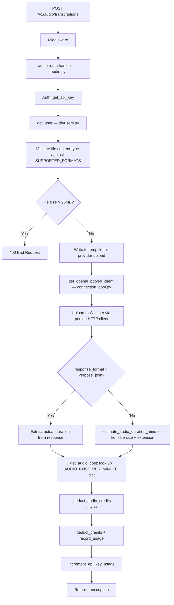

---

### Dependency Map

| Dependency | Type | Module | Purpose |
|-----------|------|--------|---------|
| `get_api_key` | Auth | `src/security/deps.py` | Auth validation |
| `get_user` | DB | `src/db/users.py` | User record lookup |
| `SUPPORTED_FORMATS` | Config | `src/routes/audio.py` | Allowed MIME types |
| `AUDIO_COST_PER_MINUTE` | Config | `src/routes/audio.py` | Per-minute pricing ($0.006 for whisper-1 and whisper-large-v3) |
| `estimate_audio_duration_minutes` | Util | `src/routes/audio.py` | File-size-based duration estimation |
| `get_audio_cost` | Pricing | `src/routes/audio.py` | Per-minute billing calculation |
| `get_openai_pooled_client` | Performance | `src/services/connection_pool.py` | Pooled HTTP client for OpenAI API |
| `_deduct_audio_credits` | Billing | `src/routes/audio.py` | Async credit deduction with fail-safe |
| `deduct_credits` | DB Write | `src/db/users.py` | Credit deduction |
| `record_usage` | DB Write | `src/db/users.py` | Usage tracking |
| `increment_api_key_usage` | DB Write | `src/db/api_keys.py` | API key counter |
| `AITracer` | Tracing | `src/utils/ai_tracing.py` | Request tracing |

---

### Side Effects

Credit deduction (billed per audio minute — minimum charge of 0.1 minutes / 6 seconds; $0.006/min for whisper-1), usage recording, API key usage increment. If credit deduction fails, the error is raised (fail-safe: users do not get free transcription on billing errors).

---

## 7. POST /auth

### What & Why (Plain English)

This is the primary login endpoint for GatewayZ users. It handles Privy-based authentication — Privy is the wallet and identity service GatewayZ uses for Web3-compatible user auth supporting email, social OAuth, and crypto wallet logins. When a user logs in via the admin dashboard, their Privy user object is sent here to be verified and processed. If this is the user's first login, a new user record is created in the database automatically. The endpoint also handles email verification via the Emailable API, referral code bonuses via `PartnerTrialService`, and cache management for fast subsequent lookups.

**Who calls it**: The GatewayZ admin dashboard on every login. Also called by any integration using Privy for authentication.

**Outcome**: Returns a `PrivyAuthResponse` with the user's GatewayZ API key, credits, plan tier, and session metadata. Creates a new user record if the user is signing in for the first time.

---

### Auth & Access

| Field | Value |
|-------|-------|
| **Authentication** | Privy user object in request body — NOT a GatewayZ API key |
| **Rate Limiting** | IP-based auth rate limit via `check_auth_rate_limit()` — 10 attempts per 15 minutes per IP |
| **Handler** | `privy_auth()` — `src/routes/auth.py:719` |
| **Public** | Yes — this is how users authenticate |

---

### Request Schema

Schema defined as `PrivyAuthRequest` in `src/schemas/`:

| Field | Type | Required | Description |
|-------|------|----------|-------------|
| `user` | object | Yes | Privy user object with `id` field |
| `is_new_user` | boolean | No | Flag from Privy SDK indicating new vs. returning user |
| `referral_code` | string | No | Referral or partner code for bonus credits |

---

### Response Schema

`PrivyAuthResponse` Pydantic model:

```json
{
  "success": true,
  "user_id": "user_abc123",
  "api_key": "gw_live_abc123...",
  "email": "user@example.com",
  "username": "user_abc123",
  "credits": 5.0,
  "plan": "trial",
  "subscription_status": "trial",
  "is_new_user": false
}
```

---

### Request Lifecycle (Mermaid)

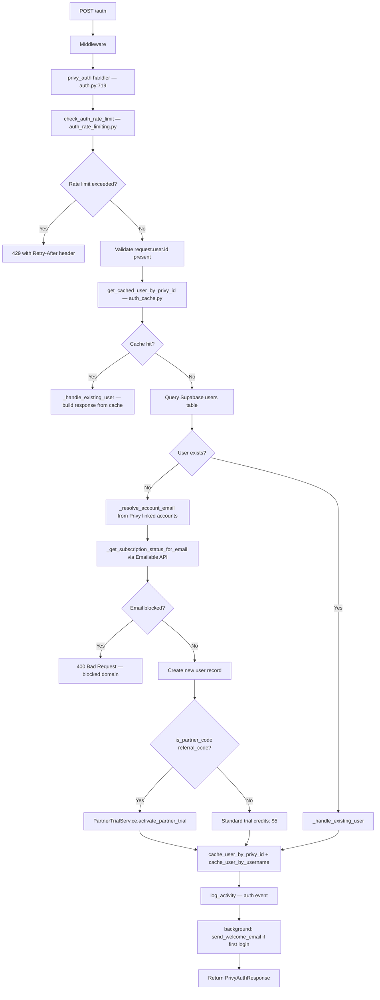

---

### Dependency Map

| Dependency | Type | Module | Purpose |
|-----------|------|--------|---------|
| `check_auth_rate_limit` | Rate Limit | `src/services/auth_rate_limiting.py` | IP-based login rate limiting |
| `get_client_ip` | Util | `src/services/auth_rate_limiting.py` | Client IP extraction |
| `get_cached_user_by_privy_id` | Cache | `src/services/auth_cache.py` | Redis user cache lookup |
| `cache_user_by_privy_id` | Cache | `src/services/auth_cache.py` | Redis user cache write |
| `cache_user_by_username` | Cache | `src/services/auth_cache.py` | Username cache write |
| `invalidate_user_cache` | Cache | `src/services/auth_cache.py` | Cache invalidation on update |
| `emailable_verify_email` | External | `src/services/email_verification.py` | Emailable API email verification |
| `is_blocked_email_domain` | Security | `src/utils/security_validators.py` | Local blocklist check |
| `is_temporary_email_domain` | Security | `src/utils/security_validators.py` | Temp email detection |
| `is_partner_code` | Service | `src/services/partner_trial_service.py` | Partner code validation |
| `PartnerTrialService` | Service | `src/services/partner_trial_service.py` | Partner trial activation |
| `safe_query_with_timeout` | Util | `src/services/query_timeout.py` | DB query with timeout protection |
| `PrivyAuthRequest` | Schema | `src/schemas/` | Request validation |
| `PrivyAuthResponse` | Schema | `src/schemas/` | Response type |
| `log_activity` | DB Write | `src/db/activity.py` | Auth event audit log |
| `enhanced_notification_service` | Service | `src/enhanced_notification_service.py` | Welcome email dispatch |
| `get_supabase_client` | DB | `src/config/supabase_config.py` | Database client |
| `_is_temporary_api_key` | Util | `src/db/users.py` | Temporary key detection |

---

### Side Effects

- **DB write**: New row in `users` table if first login (via `create_enhanced_user()`)
- **DB write**: API key created in `api_keys_new` table
- **DB write**: Trial credits set (default $5 = 250,000 tokens)
- **Redis write**: User cached by Privy ID and username via `auth_cache.py`
- **Background task**: Welcome email sent via `enhanced_notification_service.send_welcome_email()` on first login
- **Activity log**: Auth event recorded via `log_activity()`
- **Partner trial**: If valid partner code provided, `PartnerTrialService.activate_partner_trial()` grants extended trial

---

## 8. POST /auth/register

### What & Why (Plain English)

This endpoint registers a new GatewayZ user account via explicit username + email registration — distinct from the Privy-based social/wallet auth flow. It creates a user profile, assigns initial free trial credits ($5), and sets up their account in the database. It includes email verification via the Emailable API (blocking undeliverable and disposable addresses), strict IP-based rate limiting (3 attempts per hour) to prevent mass account creation, and optional referral code processing for bonus credits. In practice, the Privy-based `POST /auth` flow handles the majority of new user creation automatically; this endpoint serves specific onboarding flows where explicit username registration is required.

**Who calls it**: Admin dashboard onboarding flow for username-based registration. Sometimes called directly for programmatic user creation.

**Outcome**: Creates a new user account with free trial credits and returns the `UserRegistrationResponse` with API key.

---

### Auth & Access

| Field | Value |
|-------|-------|
| **Authentication** | No API key required — Privy token or open registration |
| **Rate Limiting** | Strict IP-based: 3 attempts per hour per IP via `AuthRateLimitType.REGISTER` |
| **Handler** | `register_user()` — `src/routes/auth.py:1382` |
| **Email Verification** | Emailable API + local blocklist + temp domain list |
| **Public** | Yes |

---

### Request Schema

Schema defined as `UserRegistrationRequest` in `src/schemas/`:

| Field | Type | Required | Description |
|-------|------|----------|-------------|
| `username` | string | Yes | Desired username — unique collision handled by `_generate_unique_username()` |
| `email` | string | Yes | User email — verified by Emailable API |
| `auth_method` | string | Yes | Registration method: `"email"`, `"google"`, `"github"`, etc. (`AuthMethod` enum) |
| `environment_tag` | string | No | `"test"`, `"staging"`, `"live"`, `"development"` — determines key prefix |
| `referral_code` | string | No | Referral code for bonus credits |

---

### Response Schema

`UserRegistrationResponse` Pydantic model:

```json
{
  "success": true,
  "user_id": "user_abc123",
  "username": "john_doe",
  "email": "john@example.com",
  "api_key": "gw_live_abc123...",
  "credits": 5.0,
  "subscription_status": "trial",
  "trial_expires_at": "2026-04-04T00:00:00Z"
}
```

---

### Side Effects

- Creates row in `users` table via `create_enhanced_user()`
- Creates API key in `api_keys_new` table with `is_trial=true` and `trial_credits=5.0`
- Sends welcome email via `enhanced_notification_service.send_welcome_email()`
- If valid referral code: bonus credits added via referral system
- Auth event logged via `log_activity()`

---

## 9. GET /user/balance

### What & Why (Plain English)

This endpoint returns a user's current credit balance — how many credits they have remaining to spend on AI inference. Credits are GatewayZ's billing currency: each API call deducts credits based on the model's pricing and the number of tokens used. The admin dashboard polls this endpoint to show the user their balance in real-time. The endpoint differentiates between trial users (showing `remaining_credits`, `remaining_tokens`, `remaining_requests`, and `trial_end_date`) and standard users (showing only `credits` and `status: "active"`). A per-endpoint rate limit of 60 requests per 60 seconds is applied via `create_endpoint_rate_limit()`.

**Who calls it**: The GatewayZ admin dashboard (polled frequently), any application checking remaining quota before making inference calls.

**Outcome**: Returns the user's current credit balance as a JSON object with plan and trial metadata.

---

### Auth & Access

| Field | Value |
|-------|-------|
| **Authentication** | Bearer API key via `get_api_key` |
| **Rate Limiting** | Endpoint-level: 60 req/60s via `_balance_rate_limit` (`create_endpoint_rate_limit`) |
| **Handler** | `get_user_balance()` — `src/routes/users.py:80` |
| **Public** | No — user-specific |

---

### Request Schema

No request body. No query parameters.

---

### Response Schema

**Trial user:**
```json
{
  "api_key": "gw_live_abc1...",
  "credits": 3.75,
  "tokens_remaining": 187500,
  "requests_remaining": 750,
  "status": "trial",
  "trial_end_date": "2026-04-04T00:00:00Z",
  "user_id": "user_abc123"
}
```

**Standard user:**
```json
{
  "api_key": "gw_live_abc1...",
  "credits": 42.50,
  "status": "active",
  "user_id": "user_abc123"
}
```

---

### Request Lifecycle (Mermaid)

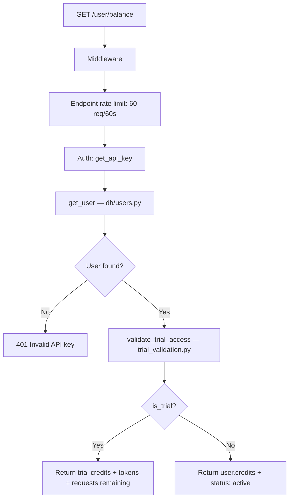

---

### Dependency Map

| Dependency | Type | Module | Purpose |
|-----------|------|--------|---------|
| `get_api_key` | Auth | `src/security/deps.py` | Auth + user context |
| `_balance_rate_limit` | Rate Limit | `src/services/endpoint_rate_limiter.py` | 60 req/60s endpoint rate limit |
| `get_user` | DB | `src/db/users.py` | Queries Supabase users table |
| `validate_trial_access` | Trial | `src/services/trial_validation.py` | Trial status + remaining quotas |

---

### Side Effects

None — read-only.

---

## 10. GET /user/profile

### What & Why (Plain English)

Returns the authenticated user's profile information — their usage metrics, rate limits, and current credit balance. This powers the user settings and monitoring pages in the admin dashboard. The `/user/monitor` endpoint (also in `users.py`) provides a richer view with detailed usage metrics and rate limit configurations. The `/user/profile` endpoint (via `get_user_profile()` in `src/db/users.py`) provides the static profile data. Both are accessible with the same API key authentication. The `/user/limit` endpoint returns the current rate limit configuration.

**Who calls it**: Admin dashboard on page load, client applications displaying user information.

**Outcome**: Returns user profile data and/or usage metrics as a JSON object.

---

### Auth & Access

| Field | Value |
|-------|-------|
| **Authentication** | Bearer API key via `get_api_key` |
| **Handler** | `user_monitor()` at `GET /user/monitor` — `src/routes/users.py:118`; profile via `get_user_profile()` |
| **Public** | No |

---

### Response Schema

`GET /user/monitor` response:
```json
{
  "status": "success",
  "timestamp": "2026-03-04T10:00:00Z",
  "user_id": "user_abc123",
  "api_key": "gw_live_abc1...",
  "current_credits": 42.50,
  "usage_metrics": {
    "total_requests": 14823,
    "total_tokens": 45200000,
    "requests_today": 142,
    "tokens_today": 850000
  },
  "rate_limits": {
    "requests_per_minute": 60,
    "requests_per_hour": 1000,
    "requests_per_day": 10000,
    "tokens_per_minute": 10000,
    "tokens_per_hour": 100000,
    "tokens_per_day": 1000000
  }
}
```

`UserProfileResponse` Pydantic model returned by `get_user_profile()`:
```json
{
  "id": "user_abc123",
  "email": "user@example.com",
  "username": "john_doe",
  "plan": "trial",
  "credits": 42.50,
  "created_at": "2026-01-15T10:30:00Z"
}
```

---

### Dependency Map

| Dependency | Type | Module | Purpose |
|-----------|------|--------|---------|
| `get_api_key` | Auth | `src/security/deps.py` | Auth |
| `get_user` | DB | `src/db/users.py` | User record lookup |
| `get_user_profile` | DB | `src/db/users.py` | Profile-specific fields |
| `get_user_usage_metrics` | DB | `src/db/users.py` | Aggregated usage statistics |
| `get_user_rate_limits` | DB | `src/db/rate_limits.py` | Per-user rate limit config |
| `check_rate_limit` | Service | `src/db/rate_limits.py` | Current usage vs. limits |
| `UserProfileResponse` | Schema | `src/schemas/` | Profile response type |
| `UserProfileUpdate` | Schema | `src/schemas/` | Profile update type (for PATCH) |

---

### Side Effects

None — read-only.

---

## 11. GET /health

### What & Why (Plain English)

The gateway liveness endpoint — a simple check that confirms the GatewayZ backend is running and can serve traffic. Railway's health check system, load balancers, and uptime monitoring services call this endpoint continuously. If it stops responding, Railway automatically restarts the service. The endpoint always returns HTTP 200 (the app is alive if it responds), but includes database connectivity status in the response body — if Supabase is unreachable, the response includes `"mode": "degraded"`. A faster variant at `/health/quick` performs no I/O at all. A comprehensive variant at `/health/system` includes Redis and provider connectivity details.

**Who calls it**: Railway health check system, load balancers, uptime monitoring (e.g. BetterStack), developers testing connectivity.

**Outcome**: Returns `{"status": "healthy"}` with HTTP 200 when the process is running. Response body indicates if database is unavailable (degraded mode).

---

### Auth & Access

| Field | Value |
|-------|-------|
| **Authentication** | None — fully public |
| **Rate Limiting** | None — must be always accessible |
| **Handler** | `health_check()` — `src/routes/health.py:106` |
| **Public** | Yes |

---

### Response Schema

**Healthy:**
```json
{
  "status": "healthy",
  "timestamp": "2026-03-04T10:00:00Z",
  "database": "connected"
}
```

**Degraded (DB unreachable but process running):**
```json
{
  "status": "healthy",
  "timestamp": "2026-03-04T10:00:00Z",
  "database": "unavailable",
  "mode": "degraded",
  "database_error": "ConnectionError"
}
```

---

### Request Lifecycle (Mermaid)

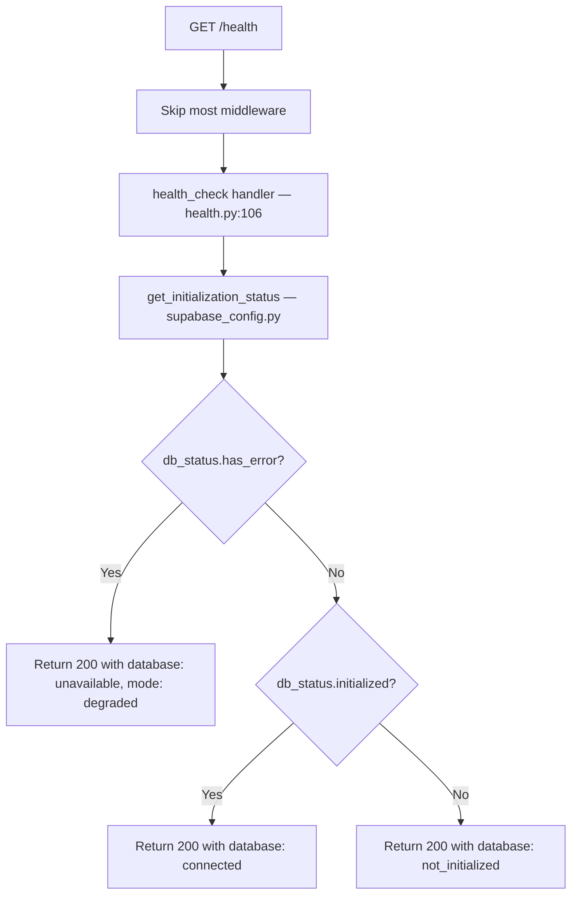

---

### Dependency Map

| Dependency | Type | Module | Purpose |
|-----------|------|--------|---------|
| `get_initialization_status` | DB | `src/config/supabase_config.py` | Supabase connectivity check |
| `supabase` | DB | `src/config/supabase_config.py` | Supabase client reference |

**Related health variants:**
- `GET /health/quick` — `health_quick()` — zero I/O, fastest response
- `GET /health/railway` — Railway-specific health check
- `GET /health/system` — `SystemHealthResponse` including Redis + Supabase + provider connectivity
- `GET /health/summary` — `HealthSummaryResponse` with model/provider aggregates
- `GET /health/database` — Database-specific connectivity check

---

### Side Effects

None — read-only diagnostic.

---

## 12. GET /v1/status/providers

### What & Why (Plain English)

This endpoint returns the current operational status of all AI providers connected to GatewayZ — OpenAI, Anthropic, Google, Groq, and all other active gateways. It powers the public-facing status page that shows users which providers are operational, degraded, or down. The data is drawn from the `provider_health_current` Supabase view, which is a pre-aggregated view populated by the dedicated health-service container (not this API process). Data includes total models per provider, healthy models, offline models, and uptime percentage. The endpoint is mounted under `/v1` via the status_page router with `prefix="/status"`.

**Who calls it**: The public status page UI (`/status`), admin dashboard, automated monitoring systems.

**Outcome**: Returns a list of provider/gateway health objects with model counts and status indicators.

---

### Auth & Access

| Field | Value |
|-------|-------|
| **Authentication** | None — fully public |
| **Rate Limiting** | Light — response sourced from pre-aggregated Supabase view |
| **Handler** | `get_providers_status()` — `src/routes/status_page.py:126` |
| **Router prefix** | Mounted under `/v1/status` (status_page router has `prefix="/status"`, loaded in v1_routes) |
| **Public** | Yes |

---

### Response Schema

Returns `list[dict[str, Any]]`:

```json
[
  {
    "provider": "openai",
    "gateway": "openrouter",
    "display_name": "OpenAI via OpenRouter",
    "status_indicator": "operational",
    "total_models": 42,
    "healthy_models": 42,
    "offline_models": 0,
    "uptime_percentage": 100.0,
    "last_updated": "2026-03-04T09:59:00Z"
  },
  {
    "provider": "anthropic",
    "gateway": "openrouter",
    "display_name": "Anthropic via OpenRouter",
    "status_indicator": "degraded",
    "total_models": 8,
    "healthy_models": 7,
    "offline_models": 1,
    "uptime_percentage": 87.5,
    "last_updated": "2026-03-04T09:59:00Z"
  }
]
```

**Note**: Data consistency check applied — `healthy_models` is capped to `total_models` if the view returns inconsistent data (can occur with stale snapshots).

---

### Request Lifecycle (Mermaid)

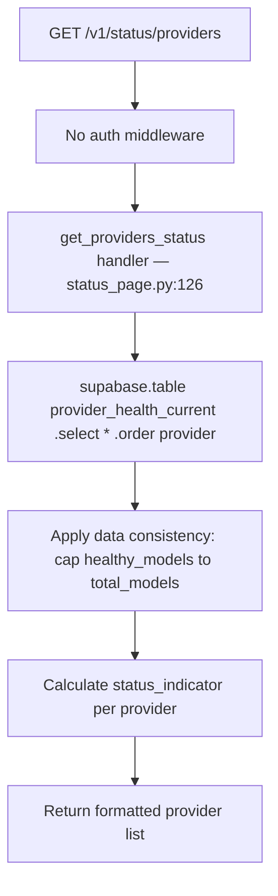

---

### Dependency Map

| Dependency | Type | Module | Purpose |
|-----------|------|--------|---------|
| `supabase` | DB | `src/config/supabase_config.py` | Supabase client |
| `provider_health_current` | DB View | Supabase | Pre-aggregated provider health view |
| `model_health_incidents` | DB Table | Supabase | Active incident tracking |

**Related status endpoints:**
- `GET /v1/status/` — `get_overall_status()` — overall system status with gateway health percentage and active incident count
- `GET /v1/status/incidents` — Active incidents list

---

### Side Effects

None — read-only.

---

## 13. GET /admin/users

### What & Why (Plain English)

This endpoint gives administrators a paginated, searchable list of all registered GatewayZ users. It is optimized specifically for large datasets — the docstring notes it only fetches users without statistics (use `/admin/users/stats` for aggregated statistics). It supports filtering by email (case-insensitive partial match), API key prefix, and active status. The endpoint accepts `limit` up to 10,000 records per page. Only users with admin API keys (validated by `require_admin` dependency) can access this endpoint.

**Who calls it**: GatewayZ admin team via the admin dashboard. Internal tooling for user management and support.

**Outcome**: Paginated list of users with profile data from the `users` table and associated `api_keys_new` records.

---

### Auth & Access

| Field | Value |
|-------|-------|
| **Authentication** | Admin API key via `require_admin` dependency (`src/security/deps.py`) |
| **Rate Limiting** | Admin rate limit |
| **Handler** | `get_all_users_info()` — `src/routes/admin.py:943` |
| **Public** | No — admin only |

---

### Request Schema

| Parameter | Type | Required | Description |
|-----------|------|----------|-------------|
| `email` | query string | No | Case-insensitive partial match — e.g. `"john"` matches `"john@example.com"` |
| `api_key` | query string | No | Case-insensitive partial match — e.g. `"gw_live"` matches keys starting with `"gw_live"` |
| `is_active` | query boolean | No | `true` = active only, `false` = inactive only, null = all |
| `limit` | query integer | No | Records per page (1–10000, default: 100) |
| `offset` | query integer | No | Records to skip (default: 0) |

---

### Response Schema

```json
{
  "users": [
    {
      "id": "user_abc123",
      "email": "user@example.com",
      "username": "john_doe",
      "credits": 42.50,
      "is_active": true,
      "created_at": "2026-02-01T00:00:00Z",
      "api_keys": [
        {
          "api_key": "gw_live_***...abc1",
          "is_primary": true,
          "is_trial": false,
          "created_at": "2026-02-01T00:00:00Z"
        }
      ]
    }
  ],
  "total": 13842,
  "limit": 100,
  "offset": 0
}
```

---

### Dependency Map

| Dependency | Type | Module | Purpose |
|-----------|------|--------|---------|
| `require_admin` | Auth | `src/security/deps.py` | Admin key validation |
| `get_all_users` | DB | `src/db/users.py` | Paginated users query |
| `supabase.table("users")` | DB | Supabase | User records |
| `supabase.table("api_keys_new")` | DB | Supabase | API key records |

**Related admin user endpoints:**
- `GET /admin/users/growth` — `get_user_growth()` — daily cumulative user growth timeseries
- `GET /admin/users/count` — Simple total user count
- `GET /admin/users/stats` — Aggregated user statistics
- `GET /admin/users/{user_id}` — Single user detail
- `GET /admin/users/by-api-key` — Look up user by API key
- `DELETE /admin/users/by-domain/{domain}` — Bulk delete users by email domain

---

### Side Effects

None — read-only.

---

## 14. POST /admin/add_credits

### What & Why (Plain English)

This endpoint lets administrators manually add credits to any user's account, identified by their API key. It is used for customer support resolutions (refunding failed requests), promotional credits, enterprise contract top-ups, and trial extensions. The operation includes two safety controls: a per-transaction cap (`Config.ADMIN_MAX_CREDIT_GRANT`) and a rolling 24-hour admin grant limit (`Config.ADMIN_DAILY_GRANT_LIMIT`) to prevent accidental large-scale credit grants. Every credit addition is recorded to the `credit_transactions` table as an `admin_credit` type transaction with the reason and admin identity stored in metadata. A minimum 10-character reason is required (enforced by Pydantic schema) for audit trail integrity.

**Who calls it**: GatewayZ admin team via the admin dashboard. Automated systems for subscription renewals and promotional campaigns.

**Outcome**: Adds the specified number of credits to the user's balance and returns the updated balance.

---

### Auth & Access

| Field | Value |
|-------|-------|
| **Authentication** | Admin API key via `require_admin` dependency |
| **Rate Limiting** | Admin rate limit — logged for audit |
| **Handler** | `admin_add_credits()` — `src/routes/admin.py:106` |
| **Safety controls** | Per-transaction cap (`ADMIN_MAX_CREDIT_GRANT`) + 24h rolling limit (`ADMIN_DAILY_GRANT_LIMIT`) |
| **Public** | No — admin only |

---

### Request Schema

Schema defined as `AddCreditsRequest` in `src/schemas/`:

| Field | Type | Required | Description |
|-------|------|----------|-------------|
| `api_key` | string | Yes | Target user's API key (used to look up user) |
| `credits` | float | Yes | Number of credits to add. Must not exceed `ADMIN_MAX_CREDIT_GRANT` |
| `reason` | string | Yes | Reason for credit grant — minimum 10 characters. Appears in audit log |

---

### Response Schema

```json
{
  "status": "success",
  "message": "Added 50.0 credits to user john_doe",
  "new_balance": 92.50,
  "user_id": "user_abc123",
  "reason": "Customer support refund for failed request batch"
}
```

---

### Request Lifecycle (Mermaid)

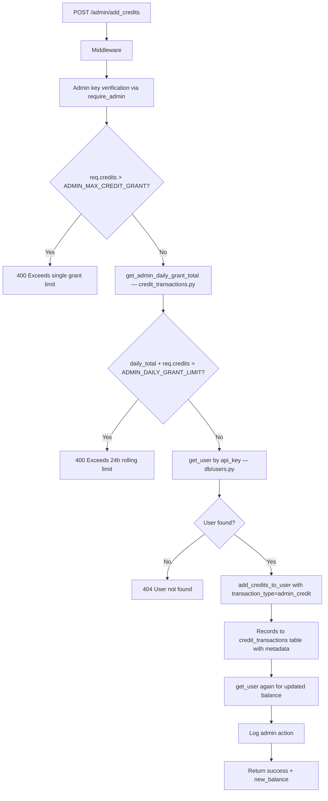

---

### Dependency Map

| Dependency | Type | Module | Purpose |
|-----------|------|--------|---------|
| `require_admin` | Auth | `src/security/deps.py` | Admin key validation |
| `AddCreditsRequest` | Schema | `src/schemas/` | Request validation (reason min 10 chars) |
| `get_admin_daily_grant_total` | DB | `src/db/credit_transactions.py` | 24-hour admin grant rolling total |
| `get_user` | DB | `src/db/users.py` | User lookup by API key |
| `add_credits_to_user` | DB Write | `src/db/users.py` | Credit balance update + transaction record |
| `Config.ADMIN_MAX_CREDIT_GRANT` | Config | `src/config/config.py` | Per-transaction cap |
| `Config.ADMIN_DAILY_GRANT_LIMIT` | Config | `src/config/config.py` | 24-hour rolling limit |
| `supabase.table("credit_transactions")` | DB | Supabase | Immutable audit trail table |

---

### Side Effects

- **DB write**: `users.credits` balance updated via `add_credits_to_user()`
- **DB write**: Row inserted into `credit_transactions` table with `transaction_type="admin_credit"`, `description=reason`, and `metadata={"reason": ..., "admin_user_id": ..., "admin_username": ...}`
- **Audit log**: Admin ID, admin username, user ID, amount, and reason all persisted
- **Log entry**: `logger.info()` records the grant for operational monitoring

---

## 15. GET /admin/monitor

### What & Why (Plain English)

This endpoint provides a real-time system-wide monitoring snapshot for administrators, drawing data from the `get_admin_monitor_data()` function in `src/db/users.py`. It gives the operations team situational awareness about system health — total users, credit consumption, recent activity — without opening Grafana. The response wraps the raw monitor data in a standard envelope with `status`, `timestamp`, and `data` fields, and includes a `warning` field if the underlying data contained partial errors (the endpoint still returns 200 in degraded mode to prevent false alerts).

**Who calls it**: GatewayZ admin dashboard monitoring page. On-call engineers during incident investigation.

**Outcome**: Returns a comprehensive system snapshot as a JSON object.

---

### Auth & Access

| Field | Value |
|-------|-------|
| **Authentication** | Admin API key via `require_admin` dependency |
| **Rate Limiting** | Admin rate limit |
| **Handler** | `admin_monitor()` — `src/routes/admin.py:206` |
| **Public** | No — admin only |

---

### Response Schema

```json
{
  "status": "success",
  "timestamp": "2026-03-04T10:00:00Z",
  "data": {
    "total_users": 13842,
    "active_users_24h": 1247,
    "total_credits_in_system": 284750.25,
    "credits_consumed_today": 12500.50,
    "total_requests_today": 384200,
    "error_rate_percent": 0.8,
    "top_models": [
      {"model": "openrouter/openai/gpt-4o", "requests": 18420}
    ]
  }
}
```

If partial data errors occur:
```json
{
  "status": "success",
  "timestamp": "...",
  "data": {...},
  "warning": "Data retrieved with errors, some information may be incomplete"
}
```

---

### Dependency Map

| Dependency | Type | Module | Purpose |
|-----------|------|--------|---------|
| `require_admin` | Auth | `src/security/deps.py` | Admin key validation |
| `get_admin_monitor_data` | DB | `src/db/users.py` | Aggregate system monitoring query |
| `supabase.table("users")` | DB | Supabase | User count aggregation |
| `supabase.table("chat_completion_requests")` | DB | Supabase | Request count aggregation |

---

### Side Effects

None — read-only (with in-process thread for async execution via `asyncio.to_thread`).

---

## 16. GET /admin/trial/analytics

### What & Why (Plain English)

This endpoint provides analytics about the GatewayZ free trial program — how many users are on active trials, how many have converted to paid plans, and an overview of trial usage aggregated from the database. It is implemented in `src/routes/admin.py` and calls `get_trial_analytics()` from `src/db/trials.py`, which uses pagination loops to fetch all records beyond Supabase's 1000-record limit. The result is optionally cached in Redis with a 5-minute TTL (cache keys `trial:analytics:summary`, `trial:domain:analysis`) to reduce database load by ~100x for repeated requests. The `trial_analytics.py` route file provides a richer set of sub-endpoints with full Pydantic response models.

**Who calls it**: GatewayZ growth/product team via the admin dashboard trial analytics page.

**Outcome**: Returns trial metrics including active/expired/converted counts, token usage, and conversion rates.

---

### Auth & Access

| Field | Value |
|-------|-------|
| **Authentication** | Admin API key via `require_admin` dependency |
| **Rate Limiting** | Admin rate limit |
| **Cache TTL** | 5 minutes (Redis keys: `trial:analytics:summary`, `trial:domain:analysis`) |
| **Handler** | `get_trial_analytics_admin()` — `src/routes/admin.py:521` |
| **Public** | No — admin only |

---

### Response Schema

```json
{
  "success": true,
  "analytics": {
    "total_trials": 1172,
    "active_trials": 13,
    "expired_trials": 847,
    "converted_trials": 312,
    "conversion_rate": 36.8,
    "total_tokens_used": 182000000,
    "avg_tokens_per_trial": 215000,
    "avg_days_to_convert": 4.2
  }
}
```

---

### Request Lifecycle (Mermaid)

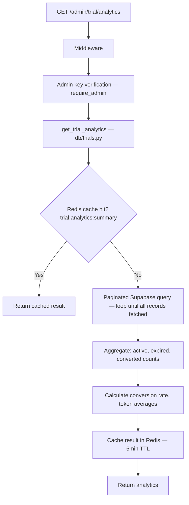

---

### Dependency Map

| Dependency | Type | Module | Purpose |
|-----------|------|--------|---------|
| `require_admin` | Auth | `src/security/deps.py` | Admin key validation |
| `get_trial_analytics` | DB | `src/db/trials.py` | Paginated trial data aggregation |
| `get_redis_config` | Cache | `src/config/redis_config.py` | Redis client for caching |
| Redis `trial:analytics:summary` | Cache | Upstash Redis | 5-minute TTL result cache |
| `supabase.table("users")` | DB | Supabase | Trial user records |
| `supabase.table("api_keys_new")` | DB | Supabase | Trial key metadata (`is_trial`, `trial_converted`, etc.) |

**Related trial analytics endpoints (from `trial_analytics.py`, require admin auth):**
- `GET /admin/trial/users` — `get_trial_users()` — detailed paginated trial user list with `TrialUsersResponse` model
- `GET /admin/trial/domain-analysis` — Domain-based abuse detection with `DomainAnalysisResponse` model
- `GET /admin/trial/conversion-funnel` — `ConversionFunnelResponse` model
- `GET /admin/trial/cohort-analysis` — `CohortAnalysisResponse` model
- `GET /admin/trial/ip-analysis` — `IPAnalysisResponse` model

---

### Side Effects

Writes computed result to Redis cache on cache miss (`invalidate_trial_analytics_cache()` clears both cache keys).

---

## 17. GET /v1/models (Extended)

### What & Why (Plain English)

The same `get_all_models()` handler (endpoint #4) supports advanced catalog querying through its full parameter set. This section documents the extended use case: querying the GatewayZ model catalog with gateway-level filtering, deduplication across providers (`unique_models=true`), and Hugging Face metric enrichment (`include_huggingface=true`). The `GATEWAY_REGISTRY` in `catalog.py` defines 30+ gateways with priority classification — fast gateways (OpenAI, Anthropic, OpenRouter, Groq, Together, Fireworks, Vercel AI, Google Vertex) are loaded eagerly; slow gateways (Featherless, Chutes, DeepInfra, Cerebras, Nebius, etc.) are loaded on demand. Also accessible at root `/models` for backwards compatibility.

**Who calls it**: Admin dashboard model management, developer tools building advanced model pickers, internal routing services needing full capability metadata.

**Outcome**: Extended model list with full gateway metadata, deduplicated across providers when requested.

---

### Auth & Access

| Field | Value |
|-------|-------|
| **Authentication** | None required — public endpoint |
| **Rate Limiting** | Light; served from `get_cached_models()` in-memory cache |
| **Handler** | `get_all_models()` — `src/routes/catalog.py:2287` |
| **Backwards compat** | Root `/models` route added by `main.py:617` |
| **Public** | Yes |

---

### Key Gateway Values for `gateway` Parameter

| Gateway slug | Display Name | Priority | Timeout |
|---|---|---|---|
| `openai` | OpenAI | fast | 30s |
| `anthropic` | Anthropic | fast | 30s |
| `openrouter` | OpenRouter | fast | 30s |
| `groq` | Groq | fast | 30s |
| `together` | Together | fast | 30s |
| `fireworks` | Fireworks | fast | 30s |
| `vercel-ai-gateway` | Vercel AI | fast | 30s |
| `google-vertex` | Google (aliases: `google`) | fast | 30s |
| `featherless` | Featherless | slow | 60s |
| `chutes` | Chutes | slow | 60s |
| `deepinfra` | DeepInfra | slow | 30s |
| `cerebras` | Cerebras | slow | 30s |
| `nebius` | Nebius | slow | 30s |
| `xai` | xAI | — | — |
| `huggingface` / `hug` | HuggingFace | slow | — |
| `aimo`, `near`, `fal`, `helicone`, `anannas`, `aihubmix`, `simplismart`, `sybil`, `morpheus`, `onerouter`, `novita` | Various | slow | 30–60s |
| `all` | All gateways aggregated | — | — |

---

### Dependency Map

Same as endpoint #4, plus:

| Dependency | Type | Module | Purpose |
|-----------|------|--------|---------|
| `fetch_specific_model` | Service | `src/services/models.py` | On-demand single model fetch |
| `check_model_exists_on_modelz` | Service | `src/services/modelz_client.py` | ModelZ model lookup |
| `get_modelz_model_details` | Service | `src/services/modelz_client.py` | ModelZ enrichment |
| `get_gateway_stats` | DB | `src/db/gateway_analytics.py` | Per-gateway usage stats |
| `get_trending_models` | DB | `src/db/gateway_analytics.py` | Trending models data |
| `enhance_providers_with_logos_and_sites` | Service | `src/services/providers.py` | Provider logo/URL enrichment |

---

### Side Effects

None — read-only with optional HuggingFace API calls on enrichment requests.

---

## 18. GET /api/monitoring/latency/{provider}/{model}

### What & Why (Plain English)

This endpoint returns real-time latency statistics for a specific provider/model combination — including count, average, P50, P95, and P99 percentiles. The data is stored in Redis by the `RedisMetrics` service and is populated by the passive health monitor as inference requests complete. The Grafana dashboards use this endpoint to display latency trends, and the admin team uses it to spot performance degradations before users notice. The endpoint is mounted at `/api/monitoring/latency/{provider}/{model}` (the monitoring router uses prefix `/api/monitoring`).

**Who calls it**: Grafana dashboard data source, admin monitoring page, automated alerting rules, developers investigating latency regressions.

**Outcome**: Returns latency percentile breakdowns for the specified provider/model pair.

---

### Auth & Access

| Field | Value |
|-------|-------|
| **Authentication** | Optional (`get_optional_api_key`) — public with rate limiting |
| **Rate Limiting** | Standard API rate limiting |
| **Handler** | `get_latency_percentiles()` — `src/routes/monitoring.py:543` |
| **Router prefix** | `prefix="/api/monitoring"` → full path: `/api/monitoring/latency/{provider}/{model}` |
| **Public** | Optional auth — unauthenticated access allowed |

---

### Request Schema

| Parameter | Type | Required | Description |
|-----------|------|----------|-------------|
| `provider` | path string | Yes | Provider name — e.g. `"openrouter"`, `"groq"`, `"featherless"` |
| `model` | path string | Yes | Model ID — e.g. `"gpt-4o"`, `"llama-3.3-70b-versatile"` |
| `percentiles` | query string | No | Comma-separated percentiles (default: `"50,95,99"`) |

---

### Response Schema

`LatencyPercentilesResponse` Pydantic model:

```json
{
  "provider": "openrouter",
  "model": "gpt-4o",
  "count": 14823,
  "avg": 1024.5,
  "p50": 842.0,
  "p95": 3200.0,
  "p99": 5100.0
}
```

Returns 404 if no latency data has been recorded for the provider/model combination yet.

---

### Request Lifecycle (Mermaid)

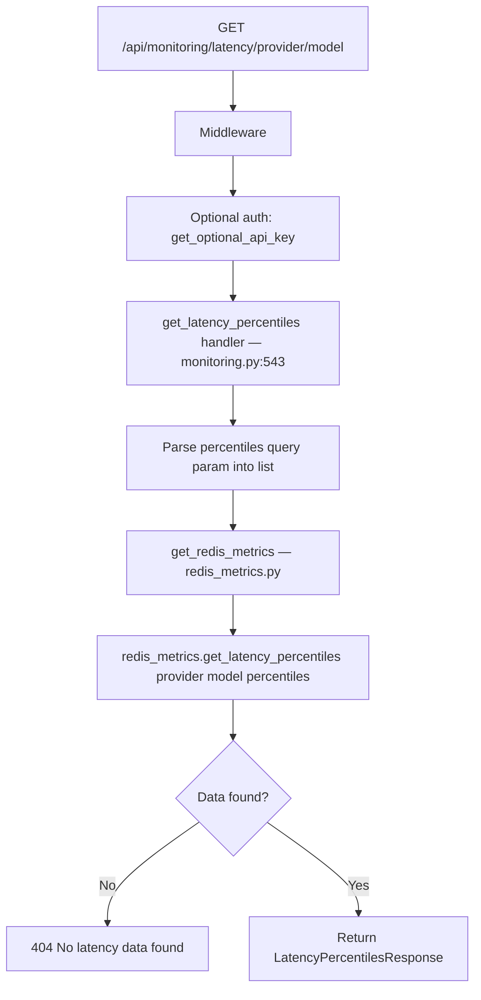

---

### Dependency Map

| Dependency | Type | Module | Purpose |
|-----------|------|--------|---------|
| `get_optional_api_key` | Auth | `src/security/deps.py` | Optional API key validation |
| `get_redis_metrics` | Service | `src/services/redis_metrics.py` | Redis metrics client factory |
| `LatencyPercentilesResponse` | Schema | `src/routes/monitoring.py` | Response type |

**Related monitoring endpoints (all under `/api/monitoring/`):**
- `GET /api/monitoring/health` — `get_all_provider_health()` — health scores for all providers
- `GET /api/monitoring/health/{provider}` — `get_provider_health()` — single provider health score
- `GET /api/monitoring/errors/{provider}` — `get_provider_errors()` — recent error list
- `GET /api/monitoring/stats/realtime` — `get_realtime_stats()` — per-provider real-time stats (configurable hours window)
- `GET /api/monitoring/stats/hourly/{provider}` — `get_hourly_stats()` — hourly provider breakdown
- `GET /api/monitoring/circuit-breakers` — `get_all_circuit_breakers()` — circuit breaker states
- `GET /api/monitoring/circuit-breakers/{provider}` — Provider-specific circuit breakers
- `GET /api/monitoring/providers/comparison` — Provider comparison analytics
- `GET /api/monitoring/anomalies` — `get_anomalies()` — cost/latency/error-rate anomaly detection
- `GET /api/monitoring/cost-analysis` — Cost breakdown by provider
- `GET /api/monitoring/chat-requests` — Chat completion requests with flexible filtering

---

### Side Effects

None — read-only Redis queries.

---

## 19. GET /admin/cache-status

### What & Why (Plain English)

This endpoint gives administrators a snapshot of the current state of the GatewayZ model catalog cache and provider cache. It reports whether the in-memory cache (managed by `src/services/model_catalog_cache.py`) has data, how old it is, its configured TTL (default 1800 seconds = 30 minutes), whether it is still valid, and how many providers are cached. This endpoint is essential during incident response when investigating whether stale cache data is causing incorrect model lists or routing decisions. A separate endpoint at `GET /admin/huggingface-cache-status` provides the same view specifically for the HuggingFace model cache.

**Who calls it**: Admin dashboard system health page. On-call engineers during incident response.

**Outcome**: Returns a cache health summary with age, validity, TTL, and cached entry counts.

---

### Auth & Access

| Field | Value |
|-------|-------|
| **Authentication** | Admin API key via `require_admin` dependency |
| **Rate Limiting** | Admin rate limit |
| **Handler** | `admin_cache_status()` — `src/routes/admin.py:291` |
| **Public** | No — admin only |

---

### Response Schema

```json
{
  "status": "success",
  "cache_info": {
    "has_data": true,
    "cache_age_seconds": 342.7,
    "ttl_seconds": 1800,
    "is_valid": true,
    "total_cached_providers": 18
  },
  "timestamp": "2026-03-04T10:00:00Z"
}
```

If cache is empty or stale:
```json
{
  "status": "success",
  "cache_info": {
    "has_data": false,
    "cache_age_seconds": null,
    "ttl_seconds": 1800,
    "is_valid": false,
    "total_cached_providers": 0
  },
  "timestamp": "2026-03-04T10:00:00Z"
}
```

---

### Dependency Map

| Dependency | Type | Module | Purpose |
|-----------|------|--------|---------|
| `require_admin` | Auth | `src/security/deps.py` | Admin key validation |
| `get_provider_cache_metadata` | Service | `src/services/model_catalog_cache.py` | Provider cache metadata |
| `get_gateway_cache_metadata` | Service | `src/services/model_catalog_cache.py` | Gateway-specific cache metadata |
| `invalidate_provider_catalog` | Service | `src/services/model_catalog_cache.py` | Cache invalidation (used by POST /admin/refresh-providers) |
| `invalidate_gateway_catalog` | Service | `src/services/model_catalog_cache.py` | Gateway cache invalidation |

**Related admin cache endpoints:**
- `POST /admin/refresh-providers` — `admin_refresh_providers()` — invalidates provider cache and forces reload
- `GET /admin/huggingface-cache-status` — `admin_huggingface_cache_status()` — HuggingFace-specific cache status
- `POST /admin/refresh-huggingface-cache` — Clear HuggingFace model cache
- `GET /admin/debug-models` — `admin_debug_models()` — full cache + provider matching debug view
- `POST /admin/clear-rate-limit-cache` — `admin_clear_rate_limit_cache()` — clears Redis rate limit manager cache

**Cache management in `system.py` (separate router, full system cache refresh):**
- `POST /system/cache/refresh/{gateway}` — Refresh specific gateway model cache
- `GET /system/cache/status` — Status across all gateways

---

### Side Effects

None — read-only.

---

## 20. GET /general-router/models

### What & Why (Plain English)

This endpoint returns the list of AI models that the GatewayZ General Router supports for intelligent, AI-powered routing via NotDiamond. The General Router is a smart model selector: instead of picking a specific model yourself, you send `model: "router:general"` (or `"router:general:quality"`, `"router:general:cost"`, `"router:general:latency"`) in any inference request and GatewayZ automatically selects the best model for your prompt using the NotDiamond routing service. This endpoint reveals the candidate model pool with their NotDiamond IDs, GatewayZ IDs, provider names, and which gateways they are available on. A companion endpoint at `GET /general-router/settings/options` returns the configuration schema for UI builders.

**Who calls it**: Admin dashboard routing configuration page. Developers building integrations that use the smart router feature. Debugging the NotDiamond routing decisions.

**Outcome**: Returns the list of NotDiamond candidate models with their GatewayZ mappings and availability.

---

### Auth & Access

| Field | Value |
|-------|-------|
| **Authentication** | None required — public endpoint |
| **Rate Limiting** | Standard routing |
| **Handler** | `get_available_models()` — `src/routes/general_router.py:95` |
| **Router prefix** | `prefix="/general-router"` → full path: `/general-router/models` |
| **Public** | Yes |

---

### Response Schema

When NotDiamond is enabled:
```json
{
  "success": true,
  "models": [
    {
      "notdiamond_id": "openai/gpt-4o",
      "gatewayz_id": "openrouter/openai/gpt-4o",
      "provider": "openai",
      "available_on": ["openrouter", "vercel-ai-gateway"]
    },
    {
      "notdiamond_id": "anthropic/claude-3-5-sonnet-20241022",
      "gatewayz_id": "openrouter/anthropic/claude-3-5-sonnet",
      "provider": "anthropic",
      "available_on": ["openrouter"]
    }
  ],
  "total": 12
}
```

When NotDiamond is disabled (no `NOTDIAMOND_API_KEY` configured):
```json
{
  "success": false,
  "error": "NotDiamond client not enabled",
  "models": []
}
```

---

### Request Lifecycle (Mermaid)

```mermaid
flowchart TD
    A[GET /general-router/models] --> B[Middleware]
    B --> C[get_available_models handler — general_router.py:95]
    C --> D[get_notdiamond_client — notdiamond_client.py]
    D --> E{client.enabled?}
    E -->|No| F[Return success=false, models=[]]
    E -->|Yes| G[client.model_mappings.candidate_models]
    G --> H[client.model_mappings.mappings for each candidate]
    H --> I[Build model objects with notdiamond_id, gatewayz_id, provider, available_on]
    I --> J[Return success=true, models list, total]
```

---

### Dependency Map

| Dependency | Type | Module | Purpose |
|-----------|------|--------|---------|
| `get_notdiamond_client` | External | `src/services/notdiamond_client.py` | NotDiamond API client factory |
| `client.model_mappings` | Config | `src/services/notdiamond_client.py` | Candidate model list + GatewayZ ID mappings |
| `client.enabled` | Config | `src/services/notdiamond_client.py` | Flag based on `NOTDIAMOND_API_KEY` env var |

**Related general-router endpoints:**
- `GET /general-router/settings/options` — `get_general_router_settings_options()` — configuration schema for UI builders (optimization modes, syntax, aliases)
- `POST /general-router/test` — `test_general_routing()` — test routing decision without making inference call; uses `route_general_prompt()` from `src/services/general_router.py`

**How to use the router in inference requests:**

| Model value | Behaviour |
|---|---|
| `"router:general"` | Balanced mode (default) |
| `"router:general:quality"` | Optimize for response quality |
| `"router:general:cost"` | Optimize for lowest cost |
| `"router:general:latency"` | Optimize for fastest response |
| `"gatewayz-general"` | Alias for `"router:general"` |
| `"gatewayz-general-quality"` | Alias for quality mode |

---

### Side Effects

None — read-only.

---

## Quick Reference Card

| # | Method | Path | Auth | Cache | Writes DB |
|---|--------|------|------|-------|-----------|
| 1 | POST | `/v1/chat/completions` | API key (`get_api_key`) | No | Yes (usage, credits, chat_completion_requests) |
| 2 | POST | `/v1/responses` | API key (`get_api_key`) | No | Yes (usage, credits) |
| 3 | POST | `/v1/messages` | API key (`get_api_key`) | No | Yes (usage, credits, model_health) |
| 4 | GET | `/v1/models` | None | In-memory | No |
| 5 | POST | `/v1/images/generations` | API key (`get_api_key`) | No | Yes (usage, credits, model_health) |
| 6 | POST | `/v1/audio/transcriptions` | API key (`get_api_key`) | No | Yes (usage, credits) |
| 7 | POST | `/auth` | Privy user object | Redis (auth_cache) | Yes (users, api_keys_new) |
| 8 | POST | `/auth/register` | None (rate limited) | No | Yes (users, api_keys_new, credit_transactions) |
| 9 | GET | `/user/balance` | API key (`get_api_key`) | No | No |
| 10 | GET | `/user/monitor` | API key (`get_api_key`) | No | No |
| 11 | GET | `/health` | None | No | No |
| 12 | GET | `/v1/status/providers` | None | No (Supabase view) | No |
| 13 | GET | `/admin/users` | Admin key (`require_admin`) | No | No |
| 14 | POST | `/admin/add_credits` | Admin key (`require_admin`) | No | Yes (users.credits, credit_transactions) |
| 15 | GET | `/admin/monitor` | Admin key (`require_admin`) | No | No |
| 16 | GET | `/admin/trial/analytics` | Admin key (`require_admin`) | Redis 5 min | No |
| 17 | GET | `/v1/models` | None | In-memory | No |
| 18 | GET | `/api/monitoring/latency/{provider}/{model}` | Optional | Redis | No |
| 19 | GET | `/admin/cache-status` | Admin key (`require_admin`) | No | No |
| 20 | GET | `/general-router/models` | None | No | No |

---

## Handler Name Reference

| # | Path | Handler function | File | Line |
|---|------|-----------------|------|------|
| 1 | `POST /v1/chat/completions` | `chat_completions()` | `src/routes/chat.py` | 1795 |
| 2 | `POST /v1/responses` | `unified_responses()` | `src/routes/chat.py` | 3621 |
| 3 | `POST /v1/messages` | (messages route handler) | `src/routes/messages.py` | — |
| 4 | `GET /v1/models` | `get_all_models()` | `src/routes/catalog.py` | 2287 |
| 5 | `POST /v1/images/generations` | (images route handler) | `src/routes/images.py` | — |
| 6 | `POST /v1/audio/transcriptions` | (audio route handler) | `src/routes/audio.py` | — |
| 7 | `POST /auth` | `privy_auth()` | `src/routes/auth.py` | 719 |
| 8 | `POST /auth/register` | `register_user()` | `src/routes/auth.py` | 1382 |
| 9 | `GET /user/balance` | `get_user_balance()` | `src/routes/users.py` | 80 |
| 10 | `GET /user/monitor` | `user_monitor()` | `src/routes/users.py` | 118 |
| 11 | `GET /health` | `health_check()` | `src/routes/health.py` | 106 |
| 12 | `GET /v1/status/providers` | `get_providers_status()` | `src/routes/status_page.py` | 126 |
| 13 | `GET /admin/users` | `get_all_users_info()` | `src/routes/admin.py` | 943 |
| 14 | `POST /admin/add_credits` | `admin_add_credits()` | `src/routes/admin.py` | 106 |
| 15 | `GET /admin/monitor` | `admin_monitor()` | `src/routes/admin.py` | 206 |
| 16 | `GET /admin/trial/analytics` | `get_trial_analytics_admin()` | `src/routes/admin.py` | 521 |
| 17 | `GET /v1/models` (extended) | `get_all_models()` | `src/routes/catalog.py` | 2287 |
| 18 | `GET /api/monitoring/latency/{provider}/{model}` | `get_latency_percentiles()` | `src/routes/monitoring.py` | 543 |
| 19 | `GET /admin/cache-status` | `admin_cache_status()` | `src/routes/admin.py` | 291 |
| 20 | `GET /general-router/models` | `get_available_models()` | `src/routes/general_router.py` | 95 |

---

*Last updated: March 2026 — GatewayZ v2.0.4*
*Source: `gatewayz-backend` — route files in `src/routes/` — 43 total routes, 85,080 LOC*
*Auth dependency: `src/security/deps.py` — `get_api_key`, `get_optional_api_key`, `require_admin`*
*Pricing config: `src/data/manual_pricing.json` (primary) + `src/services/pricing_lookup.py`*
