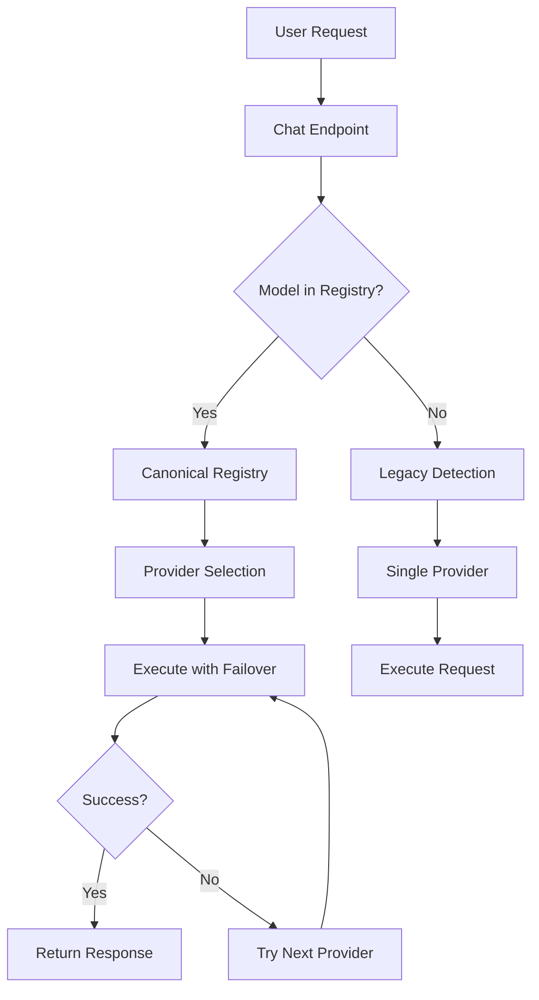

# Multi-Provider Routing System

## Overview

The Gatewayz Multi-Provider Routing System enables models to be accessed through multiple providers with automatic failover, cost optimization, and intelligent provider selection. This document describes the architecture, configuration, and usage of the system.

## Architecture

### Components

1. **Canonical Model Registry** (`src/services/canonical_model_registry.py`)
   - Central registry that aggregates model metadata from all providers
   - Handles model aliases and canonical ID resolution
   - Tracks health metrics and circuit breaker states
   - Provides intelligent provider selection based on various strategies

2. **Multi-Provider Registry** (`src/services/multi_provider_registry.py`)
   - Legacy registry maintained for backward compatibility
   - Defines data structures for multi-provider models
   - Provides basic provider selection logic

3. **Provider Selector** (`src/services/provider_selector.py`)
   - Implements automatic failover with retry logic
   - Tracks provider health with circuit breaker pattern
   - Provides provider recommendations based on optimization criteria

4. **Provider Failover** (`src/services/provider_failover.py`)
   - Builds dynamic failover chains based on model registry
   - Maps provider errors to appropriate HTTP responses
   - Determines when to trigger failover attempts

5. **Model Transformations** (`src/services/model_transformations.py`)
   - Transforms model IDs to provider-specific formats
   - Detects appropriate provider for a given model
   - Integrates with canonical registry for ID resolution

## Data Flow



## Configuration

### Registering a New Model

Models can be registered in the canonical registry with multiple provider configurations:

```python
from src.services.canonical_model_registry import CanonicalModel, get_canonical_registry

# Create a canonical model
model = CanonicalModel(
    id="llama-3.1-70b-instruct",
    name="Llama 3.1 70B Instruct",
    description="Meta's 70B parameter instruction-tuned model"
)

# Add provider configurations
model.add_provider(
    provider_name="openrouter",
    provider_model_id="meta-llama/llama-3.1-70b-instruct",
    context_length=131072,
    modalities=["text"],
    features=["streaming"],
    input_cost=0.52,
    output_cost=0.75
)

model.add_provider(
    provider_name="together",
    provider_model_id="meta-llama/Meta-Llama-3.1-70B-Instruct-Turbo",
    context_length=131072,
    modalities=["text"],
    features=["streaming"],
    input_cost=0.88,
    output_cost=0.88
)

model.add_provider(
    provider_name="fireworks",
    provider_model_id="accounts/fireworks/models/llama-v3p1-70b-instruct",
    context_length=131072,
    modalities=["text"],
    features=["streaming"],
    input_cost=0.90,
    output_cost=0.90
)

# Register the model
registry = get_canonical_registry()
registry.register_canonical_model(model)
```

### Adding Model Aliases

Aliases allow users to reference models using alternative names:

```python
registry.add_alias("llama-70b", "llama-3.1-70b-instruct")
registry.add_alias("llama3-70b", "llama-3.1-70b-instruct")
```

### Provider Priority Configuration

Providers are selected based on priority (lower number = higher priority):

```python
from src.services.multi_provider_registry import ProviderConfig

config = ProviderConfig(
    name="openrouter",
    model_id="model-id",
    priority=1,  # Highest priority
    requires_credentials=False,
    cost_per_1k_input=0.50,
    cost_per_1k_output=1.00,
    features=["streaming", "function_calling"]
)
```

## Usage

### Basic Request with Automatic Failover

When a model is registered with multiple providers, the system automatically handles failover:

```python
# User makes a request to a model
POST /v1/chat/completions
{
    "model": "llama-70b",  # Uses alias
    "messages": [{"role": "user", "content": "Hello"}]
}

# System automatically:
# 1. Resolves "llama-70b" to "llama-3.1-70b-instruct"
# 2. Selects best available provider (e.g., openrouter)
# 3. If openrouter fails, tries together
# 4. If together fails, tries fireworks
# 5. Returns response from first successful provider
```

### Provider Selection Strategies

The system supports multiple strategies for selecting providers:

1. **Priority** (default) - Select based on configured priority
2. **Cost** - Select cheapest provider first
3. **Latency** - Select fastest provider based on historical metrics
4. **Balanced** - Balance between cost, latency, and reliability

```python
from src.services.canonical_model_registry import get_canonical_registry

registry = get_canonical_registry()
providers = registry.select_providers_with_failover(
    model_id="gpt-4o",
    max_providers=3,
    selection_strategy="cost",  # Optimize for cost
    required_features=["streaming"]
)
```

### Health Tracking and Circuit Breakers

The system tracks provider health and temporarily disables failing providers:

```python
# Record request outcomes
registry.record_request_outcome(
    model_id="llama-70b",
    provider="openrouter",
    success=True,
    latency_ms=250.5
)

# Get health metrics
metrics = registry.get_health_metrics("llama-70b", "openrouter")
print(f"Success rate: {metrics['openrouter'].success_rate:.2%}")
print(f"Avg latency: {metrics['openrouter'].avg_latency_ms:.2f}ms")
```

Circuit breaker states:
- **Closed**: Normal operation
- **Open**: Provider disabled after too many failures
- **Half-open**: Testing if provider has recovered

### Provider Recommendations

Get provider recommendations based on optimization criteria:

```python
from src.services.provider_selector import get_selector

selector = get_selector()
recommendations = selector.get_provider_recommendations(
    model_id="claude-3.5-sonnet",
    optimize_for="balanced",  # or "cost", "latency", "reliability"
    required_features=["streaming", "multimodal"]
)

for rec in recommendations:
    print(f"Rank {rec['rank']}: {rec['provider']}")
    print(f"  Cost: ${rec['cost_per_1k']['total']:.2f}/1K tokens")
    print(f"  Reasons: {', '.join(rec['reasons'])}")
```

## Migration from Single Provider

### Migrating Existing Provider Catalogs

Use the migration utilities to import provider catalogs:

```python
from src.services.registry_migration import RegistryMigrator, ProviderMigrationConfig
import asyncio

async def migrate_providers():
    migrator = RegistryMigrator()

    # Configure migration for a provider
    config = ProviderMigrationConfig(
        provider_name="openrouter",
        fetch_catalog_fn=fetch_openrouter_models,
        default_features=["streaming"]
    )

    # Run migration
    stats = await migrator.migrate_provider(config)
    print(f"Migrated {stats['models_added']} new models")
    print(f"Updated {stats['models_updated']} existing models")

asyncio.run(migrate_providers())
```

### Validating Multi-Provider Setup

Validate that models are correctly configured for multi-provider routing:

```python
from src.services.registry_migration import validate_multi_provider_routing

result = validate_multi_provider_routing(
    model_id="gpt-4o",
    min_providers=2
)

if result["valid"]:
    print(f"✓ Model has {len(result['enabled_providers'])} providers")
    print(f"Providers: {', '.join(result['enabled_providers'])}")
else:
    print(f"✗ {result['reason']}")
```

## Pre-Configured Models

The system comes with pre-configured multi-provider support for popular models:

### OpenAI Models
- `gpt-4o` - Available via: openrouter, portkey, together
- `gpt-4o-mini` - Available via: openrouter, portkey, fireworks
- `gpt-3.5-turbo` - Available via: openrouter, portkey

### Anthropic Models
- `claude-3.5-sonnet` - Available via: openrouter, portkey, google-vertex
- `claude-3-haiku` - Available via: openrouter, portkey, google-vertex
- `claude-3-opus` - Available via: openrouter, portkey, google-vertex

### Meta Llama Models
- `llama-3.1-405b-instruct` - Available via: openrouter, together, fireworks, deepinfra
- `llama-3.1-70b-instruct` - Available via: openrouter, together, fireworks, deepinfra, featherless
- `llama-3.1-8b-instruct` - Available via: openrouter, together, fireworks, deepinfra, featherless, huggingface

### Google Models
- `gemini-2.5-flash` - Available via: google-vertex, openrouter
- `gemini-2.5-pro` - Available via: google-vertex, openrouter
- `gemini-2.0-flash` - Available via: google-vertex, openrouter

### Mistral Models
- `mistral-large` - Available via: openrouter, portkey
- `mixtral-8x22b-instruct` - Available via: openrouter, together, deepinfra
- `mixtral-8x7b-instruct` - Available via: openrouter, together, fireworks, deepinfra, featherless

## API Compatibility

The multi-provider routing system maintains full backward compatibility with existing API clients:

- Model IDs work the same way
- Response formats are unchanged
- Error handling follows the same patterns
- Rate limiting and pricing hooks are preserved

## Performance Considerations

### Caching
- Provider catalogs are cached to reduce lookup overhead
- Health metrics are kept in memory for fast access
- Model transformations are memoized

### Failover Timing
- Default timeout per provider: 30 seconds
- Circuit breaker opens after 5 failures (configurable)
- Recovery timeout: 5 minutes (configurable)

### Request Prioritization
- Requests are prioritized based on user tier
- Premium users get access to more failover attempts
- System automatically load-balances across providers

## Monitoring and Observability

### Metrics Tracked
- Success/failure rates per provider per model
- Average latency per provider per model
- Circuit breaker state changes
- Failover attempts and success rates

### Logging
All provider selection, failover attempts, and health state changes are logged:

```
INFO: Canonical model gpt-4o: selected openrouter (canonical: gpt-4o)
INFO: Attempt 1/3: Trying openrouter for gpt-4o (provider model ID: openai/gpt-4o)
WARNING: Request failed with openrouter for gpt-4o: Connection timeout
INFO: Attempt 2/3: Trying portkey for gpt-4o (provider model ID: gpt-4o)
INFO: ✓ Request successful with portkey for gpt-4o (latency: 523.45ms)
```

### Health Endpoints
- `/health/providers` - Overall provider health status
- `/health/models/{model_id}` - Health status for specific model
- `/metrics` - Prometheus-compatible metrics

## Troubleshooting

### Common Issues

1. **Model not found in registry**
   - Check if model is registered: `registry.get_canonical_model(model_id)`
   - Verify aliases are configured correctly
   - Ensure startup initialization completed successfully

2. **All providers failing**
   - Check circuit breaker states
   - Verify provider credentials are configured
   - Review provider-specific error messages in logs

3. **Unexpected provider selection**
   - Check provider priorities
   - Review health metrics for providers
   - Verify selection strategy is appropriate

### Debug Mode

Enable debug logging for detailed routing information:

```python
import logging
logging.getLogger("src.services.canonical_model_registry").setLevel(logging.DEBUG)
logging.getLogger("src.services.provider_selector").setLevel(logging.DEBUG)
logging.getLogger("src.services.provider_failover").setLevel(logging.DEBUG)
```

## Future Enhancements

Planned improvements to the multi-provider routing system:

1. **Dynamic Cost Optimization**
   - Real-time cost tracking
   - Budget-aware provider selection
   - Cost alerts and limits

2. **Advanced Health Metrics**
   - P95/P99 latency tracking
   - Error categorization
   - Predictive failure detection

3. **Smart Load Balancing**
   - Provider capacity awareness
   - Geographic routing
   - Time-of-day optimization

4. **Provider Feature Discovery**
   - Automatic capability detection
   - Feature compatibility matrix
   - Version-aware routing

## Contributing

To add support for a new provider:

1. Create provider client in `src/services/`
2. Add provider configuration in `model_registry_config.py`
3. Update migration utilities if needed
4. Add tests for the new provider
5. Update this documentation

For more details, see the [Contributing Guide](CONTRIBUTING.md).