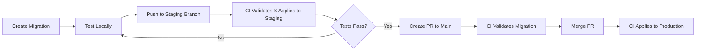

# Supabase Migrations CI/CD Setup

This guide explains how to set up automated Supabase migrations using GitHub Actions.

## Overview

The `supabase-migrations.yml` workflow automatically applies database migrations to your Supabase project when migration files change. It supports:

- ✅ Automatic migration on push to `main` (production) or `staging` branches
- ✅ Migration validation on pull requests (dry-run)
- ✅ Manual workflow dispatch with environment selection
- ✅ Destructive operation detection
- ✅ SQL syntax validation
- ✅ Migration rollback guidance
- ✅ Multi-environment support (production + staging)

## Workflow Triggers

The workflow runs automatically when:

1. **Push to main/staging** with changes to `supabase/migrations/*.sql`
2. **Pull request** to main/staging with migration file changes (validation only)
3. **Manual dispatch** from GitHub Actions UI (can choose environment)

## Required Secrets

You need to configure the following secrets in your GitHub repository settings:

### Production Environment

| Secret Name | Description | How to Get It |
|-------------|-------------|---------------|
| `SUPABASE_ACCESS_TOKEN` | Supabase CLI access token | [Generate from Dashboard](https://supabase.com/dashboard/account/tokens) |
| `SUPABASE_URL` | Project URL | Dashboard > Settings > API > Project URL |
| `SUPABASE_SERVICE_ROLE_KEY` | Service role key (anon key) | Dashboard > Settings > API > service_role key |
| `SUPABASE_PROJECT_REF` | Project reference ID | From your project URL: `https://ynleroehyrmaafkgjgmr.supabase.co` → `ynleroehyrmaafkgjgmr` |
| `SUPABASE_DB_PASSWORD` | Database password | Dashboard > Settings > Database > Database password |

### Staging Environment (Optional)

If you have a separate staging Supabase project, add these:

| Secret Name | Description |
|-------------|-------------|
| `SUPABASE_STAGING_URL` | Staging project URL |
| `SUPABASE_STAGING_SERVICE_ROLE_KEY` | Staging service role key |
| `SUPABASE_STAGING_PROJECT_REF` | Staging project reference |
| `SUPABASE_STAGING_DB_PASSWORD` | Staging database password |

## Setting Up Secrets

### Step 1: Generate Supabase Access Token

1. Go to https://supabase.com/dashboard/account/tokens
2. Click **"Generate new token"**
3. Give it a name like "GitHub Actions"
4. Copy the token (you won't be able to see it again!)
5. Add it to GitHub as `SUPABASE_ACCESS_TOKEN`

### Step 2: Get Project Credentials

1. Open your Supabase project dashboard
2. Go to **Settings > API**
3. Copy:
   - **Project URL** → `SUPABASE_URL`
   - **service_role key** → `SUPABASE_SERVICE_ROLE_KEY`
   - **Project Ref** (from URL) → `SUPABASE_PROJECT_REF`

4. Go to **Settings > Database**
5. Reset database password if needed and copy it → `SUPABASE_DB_PASSWORD`

### Step 3: Add Secrets to GitHub

1. Go to your GitHub repository
2. Click **Settings > Secrets and variables > Actions**
3. Click **"New repository secret"**
4. Add each secret with the exact names shown above

## Usage

### Automatic Migration (Recommended)

1. Create or modify migration files in `supabase/migrations/`
2. Commit and push to `main` or `staging` branch
3. The workflow automatically:
   - Validates SQL syntax
   - Checks for destructive operations
   - Applies migrations to the appropriate environment
   - Notifies on success/failure

### Manual Migration

1. Go to **Actions** tab in GitHub
2. Select **"Supabase Migrations"** workflow
3. Click **"Run workflow"**
4. Choose:
   - **Environment**: `production` or `staging`
   - **Dry run**: `true` to validate only, `false` to apply
5. Click **"Run workflow"**

## Migration File Guidelines

### Naming Convention

Migrations should follow this pattern:
```
supabase/migrations/YYYYMMDDHHMMSS_descriptive_name.sql
```

Example:
```
supabase/migrations/20251126120000_add_user_preferences_table.sql
```

### Best Practices

1. **Always make migrations idempotent**:
   ```sql
   -- ✅ Good
   CREATE TABLE IF NOT EXISTS users (...);
   DROP POLICY IF EXISTS "Users can read own data" ON users;
   CREATE POLICY "Users can read own data" ON users ...;

   -- ❌ Bad
   CREATE TABLE users (...);
   CREATE POLICY "Users can read own data" ON users ...;
   ```

2. **Use transactions for multi-step migrations**:
   ```sql
   BEGIN;

   ALTER TABLE users ADD COLUMN IF NOT EXISTS new_field TEXT;
   UPDATE users SET new_field = 'default' WHERE new_field IS NULL;

   COMMIT;
   ```

3. **Add comments to explain complex logic**:
   ```sql
   -- Add RLS policy for user data access
   -- Users can only read their own data via privy_user_id
   CREATE POLICY "Users read own data" ON users
   FOR SELECT USING (
       privy_user_id::text = auth.uid()::text
   );
   ```

4. **Avoid destructive operations in production**:
   The workflow blocks these in production:
   - `DROP DATABASE`
   - `DROP SCHEMA public`
   - `TRUNCATE ... CASCADE`
   - `DELETE FROM ... WHERE 1=1`

## Workflow Jobs

### 1. Setup Environment
- Determines target environment based on branch/input
- Sets appropriate credentials for the environment

### 2. Validate Migrations
- Checks SQL syntax
- Detects dangerous operations
- Lists new migrations

### 3. Apply Migrations
- Authenticates with Supabase
- Links to the correct project
- Applies pending migrations
- Verifies application

### 4. Rollback on Failure (Staging Only)
- Provides rollback instructions
- Links to backup restoration

### 5. Notify
- Posts summary to PR (if applicable)
- Shows migration status

## Troubleshooting

### Error: "Authentication failed"

**Cause**: Invalid `SUPABASE_ACCESS_TOKEN` or `SUPABASE_DB_PASSWORD`

**Solution**:
1. Regenerate access token from Supabase dashboard
2. Update GitHub secret
3. Verify database password is correct

### Error: "Failed to link to Supabase project"

**Cause**: Invalid `SUPABASE_PROJECT_REF` or network issues

**Solution**:
1. Verify project reference matches your project URL
2. Check that the project exists and is accessible
3. Ensure you have correct permissions

### Error: "Migration already applied"

**Cause**: Migration file was already run on the database

**Solution**:
```bash
# Locally, repair the migration status
supabase migration repair --status applied <timestamp>
```

### Error: "Policy already exists"

**Cause**: Migration is not idempotent

**Solution**: Update migration to use `DROP POLICY IF EXISTS` before creating:
```sql
DROP POLICY IF EXISTS "policy_name" ON table_name;
CREATE POLICY "policy_name" ON table_name ...;
```

### Error: "Sequence does not exist"

**Cause**: Sequence referenced before creation

**Solution**: Create sequences before tables that use them:
```sql
-- Create sequences first
CREATE SEQUENCE IF NOT EXISTS table_id_seq;

-- Then create table
CREATE TABLE table_name (
    id bigint DEFAULT nextval('table_id_seq'::regclass),
    ...
);

-- Set ownership
ALTER SEQUENCE table_id_seq OWNED BY table_name.id;
```

## Manual Rollback

If migrations fail and you need to rollback:

### Option 1: Repair Migration Status

```bash
# Mark migration as reverted
supabase migration repair --status reverted <timestamp>

# Then fix the migration file and reapply
supabase db push
```

### Option 2: Restore from Backup

1. Go to Supabase Dashboard
2. Navigate to **Database > Backups**
3. Select a backup from before the migration
4. Click **"Restore"**

## Testing Migrations Locally

Before pushing, test migrations locally:

```bash
# Start local Supabase
supabase start

# Apply migrations
supabase db push

# If successful, commit and push
git add supabase/migrations/
git commit -m "Add new migration"
git push
```

## Environment Configuration

### Branch → Environment Mapping

| Branch | Environment | Auto-deploy |
|--------|-------------|-------------|
| `main` | Production | ✅ Yes |
| `staging` | Staging | ✅ Yes |
| `develop` | Manual only | ❌ No |
| PR to main/staging | Validation only | ❌ No |

### Pull Request Behavior

When you open a PR with migration changes:
1. ✅ Migrations are **validated** (syntax, dangerous ops)
2. ❌ Migrations are **NOT applied** automatically
3. ℹ️ Comment shows validation results
4. ✅ Safe to merge after validation passes

## Security Considerations

1. **Never commit secrets**: Use GitHub Secrets, never hardcode credentials
2. **Use service_role key carefully**: It bypasses RLS, only use in CI/CD
3. **Limit access token scope**: Use project-specific tokens when possible
4. **Review destructive operations**: Manual review required for DROP/TRUNCATE
5. **Test in staging first**: Always test migrations in staging before production

## Example Migration Workflow



## Monitoring

After migration:

1. **Check workflow logs**: GitHub Actions > Supabase Migrations
2. **Verify in Supabase Dashboard**: Database > Migrations
3. **Test application**: Ensure API still works
4. **Monitor errors**: Check error logs for any issues

## Support

If you encounter issues:

1. Check workflow logs in GitHub Actions
2. Review this documentation
3. Check Supabase CLI docs: https://supabase.com/docs/guides/cli
4. Open an issue in the repository

---

**Last Updated**: 2025-11-26
**Workflow Version**: 1.0
