# `/v1/models?gateway=all&unique=true` — Full Request Flow

```mermaid
flowchart TD
    %% ── Client ──
    CLIENT["🌐 Client Request\nGET /v1/models?gateway=all&unique=true\nAuthorization: Bearer gw_live_..."]

    %% ── Middleware Pipeline ──
    subgraph MW["Middleware Pipeline"]
        direction TB
        MW1["RequestIDMiddleware\nsrc/middleware/request_id_middleware.py\nGenerates X-Request-ID"]
        MW2["TraceContextMiddleware\nsrc/middleware/trace_context_middleware.py\nInjects OpenTelemetry trace context"]
        MW3["AutoSentryMiddleware\nsrc/middleware/auto_sentry_middleware.py\nCaptures unhandled exceptions"]
        MW4["ConcurrencyMiddleware\nsrc/middleware/concurrency_middleware.py\nAdmission gate + queue"]
        MW5["RequestTimeoutMiddleware\nsrc/middleware/request_timeout_middleware.py\nasyncio.timeout(55s)"]
        MW6["SecurityMiddleware\nsrc/middleware/security_middleware.py\nIP rate limiting (300/60 RPM)\nAuth bypass · Velocity mode"]
        MW7["CORSMiddleware\nBuilt-in FastAPI\nOrigin / preflight handling"]
        MW8["ObservabilityMiddleware\nsrc/middleware/observability_middleware.py\nPrometheus: requests_in_progress,\nhttp_requests_total, duration"]
        MW9["SelectiveGZipMiddleware\nsrc/middleware/selective_gzip_middleware.py\nCompress if response > 10 KB"]
        MW10["StagingSecurityMiddleware\nsrc/middleware/staging_security.py\nBlocks unauthorized staging access"]
        MW11["DeprecationMiddleware\nsrc/middleware/deprecation.py\nAdds Deprecation headers"]

        MW1 --> MW2 --> MW3 --> MW4 --> MW5 --> MW6 --> MW7 --> MW8 --> MW9 --> MW10 --> MW11
    end

    %% ── Route Layer ──
    subgraph ROUTE["Route Layer — src/routes/catalog.py"]
        direction TB
        R1["get_all_models()\nLine 2372 · GET /models\nDelegates to get_models()"]
        R2["get_models()\nLine 857 · Main orchestration\ngateway='all', unique_models=True"]
        R3["normalize_developer_segment()\nLine 606\nNormalize provider aliases"]
        R1 --> R2
        R2 --> R3
    end

    %% ── L1 Cache ──
    subgraph L1["Layer 1 — Catalog Response Cache"]
        direction TB
        L1_CHECK["get_cached_catalog_response()\nsrc/services/catalog_response_cache.py:87"]
        L1_REDIS[("Redis\nGET catalog:v2:all:{md5hash}\nTTL: 300s (5 min)")]
        L1_HIT{"Cache\nHit?"}
        L1_CHECK --> L1_REDIS --> L1_HIT
    end

    %% ── L2 Cache ──
    subgraph L2["Layer 2 — Unique Models Cache"]
        direction TB
        L2_CALL["get_cached_models('all', unique=True)\nsrc/services/models.py:861\n→ get_cached_unique_models_catalog()"]
        L2_CACHE["ModelCatalogCache.get_unique_models()\nsrc/services/model_catalog_cache.py:935"]
        L2_REDIS[("Redis\nGET models:unique\nTTL: 900s (15 min)")]
        L2_HIT{"Cache\nHit?"}
        L2_CALL --> L2_CACHE --> L2_REDIS --> L2_HIT
    end

    %% ── Database Layer ──
    subgraph DB["Layer 3 — Supabase (PostgreSQL)"]
        direction TB
        DB1["get_all_unique_models_for_catalog()\nsrc/db/models_catalog_db.py:1440"]
        DB_Q1[("Query 1\nSELECT * FROM unique_models")]
        DB_Q2[("Query 2\nSELECT * FROM unique_models_provider\nJOIN models JOIN providers\nWHERE models.is_active = true")]
        DB_TRANSFORM["transform_unique_models_batch()\nsrc/db/models_catalog_db.py:1744\nPython transform + pricing enrichment"]
        DB1 --> DB_Q1
        DB1 --> DB_Q2
        DB_Q1 --> DB_TRANSFORM
        DB_Q2 --> DB_TRANSFORM
    end

    %% ── Pricing Enrichment ──
    subgraph PRICING["Pricing Enrichment — src/services/pricing_lookup.py"]
        direction TB
        P1["enrich_model_with_pricing()\nLine 289 · 3-tier lookup"]
        P_DB[("Tier 1: Supabase\nSELECT * FROM model_pricing")]
        P_JSON["Tier 2: manual_pricing.json\nStatic JSON file"]
        P_XREF["Tier 3: Cross-reference\nOpenRouter catalog cache"]
        P1 --> P_DB
        P_DB -->|miss| P_JSON
        P_JSON -->|miss| P_XREF
    end

    %% ── Provider List Assembly ──
    subgraph PROV["Provider List Assembly"]
        direction TB
        PROV_OR["get_cached_providers()\nsrc/services/providers.py:20\nIn-memory cache (1 hr TTL)"]
        PROV_FETCH["fetch_providers_from_openrouter()\nsrc/services/providers.py:35"]
        PROV_API[("External HTTP\nhttpx.get('https://openrouter.ai/\napi/v1/providers')")]
        PROV_LOGOS["enhance_providers_with_logos_and_sites()\nsrc/services/providers.py:187\nAdd logo URLs & site URLs"]
        PROV_DERIVE["derive_providers_from_models()\nsrc/routes/catalog.py:642\nSynthesize providers from model data\n(featherless, deepinfra, chutes, etc.)"]
        PROV_MERGE["merge_provider_lists()\nsrc/routes/catalog.py:686\nDeduplicate all providers by slug"]

        PROV_OR -->|miss| PROV_FETCH --> PROV_API
        PROV_OR --> PROV_LOGOS
        PROV_FETCH --> PROV_LOGOS
        PROV_LOGOS --> PROV_MERGE
        PROV_DERIVE --> PROV_MERGE
    end

    %% ── Fallback Parallel Fetch ──
    subgraph FALLBACK["Fallback — Parallel Catalog Fetch\n(only if L2 cache empty)"]
        direction TB
        FB1["fetch_and_merge_all_providers(timeout=30s)\nsrc/services/parallel_catalog_fetch.py"]
        FB2["ThreadPoolExecutor(10 workers)\n27 providers in parallel"]
        FB3["fetch_provider_with_circuit_breaker()\nCircuit breaker per provider"]
        FB4["get_cached_models(provider)\nPer-provider 3-tier cache"]
        FB1 --> FB2 --> FB3 --> FB4
    end

    %% ── Model Enhancement ──
    subgraph ENHANCE["Model Enhancement Loop"]
        direction TB
        E1["Paginate: models[0:100]"]
        E2["enhance_model_with_provider_info()\nsrc/services/models.py:2751\nAttach provider_site_url +\nmodel_logo_url (favicon URL)"]
        E1 --> E2
    end

    %% ── Response ──
    subgraph RESP["Response Construction"]
        direction TB
        RESP1["Build result dict\ndata, total, returned, offset,\nlimit, has_more, gateway, timestamp"]
        RESP2["cache_catalog_response()\nRedis SETEX catalog:v2:all:{hash}\nTTL: 300s"]
        RESP3["Return Response(json)\nHeaders: Cache-Control, ETag, Vary"]
        RESP1 --> RESP2 --> RESP3
    end

    %% ── Redis Detail ──
    subgraph REDIS_OPS["Redis Keys Used"]
        direction LR
        RK1["catalog:v2:all:{hash}\n5 min TTL"]
        RK2["models:unique\n15 min TTL"]
        RK3["models:catalog:full\n15 min TTL"]
        RK4["models:provider:{slug}\n30 min TTL"]
        RK5["catalog:metadata:all\n24 hr TTL"]
        RK6["IP rate limit counters\n60s TTL"]
    end

    %% ── Connections ──
    CLIENT --> MW
    MW --> ROUTE
    ROUTE --> L1
    L1_HIT -->|"✅ HIT"| RESP3
    L1_HIT -->|"❌ MISS"| L2
    L2_HIT -->|"✅ HIT"| PROV
    L2_HIT -->|"❌ MISS"| DB
    DB_TRANSFORM --> PRICING
    PRICING --> L2_CACHE
    L2 -->|"empty result"| FALLBACK
    L2 --> PROV
    PROV_MERGE --> ENHANCE
    FALLBACK --> PROV
    ENHANCE --> RESP

    %% ── Styling ──
    classDef middleware fill:#f9e2af,stroke:#f5c211,color:#000
    classDef route fill:#a6e3a1,stroke:#40a02b,color:#000
    classDef cache fill:#89b4fa,stroke:#1e66f5,color:#000
    classDef database fill:#f38ba8,stroke:#d20f39,color:#000
    classDef service fill:#cba6f7,stroke:#8839ef,color:#000
    classDef response fill:#94e2d5,stroke:#179299,color:#000
    classDef redis fill:#74c7ec,stroke:#209fb5,color:#000
    classDef external fill:#fab387,stroke:#fe640b,color:#000

    class MW1,MW2,MW3,MW4,MW5,MW6,MW7,MW8,MW9,MW10,MW11 middleware
    class R1,R2,R3 route
    class L1_CHECK,L1_HIT,L2_CALL,L2_CACHE,L2_HIT cache
    class L1_REDIS,L2_REDIS,RK1,RK2,RK3,RK4,RK5,RK6 redis
    class DB1,DB_Q1,DB_Q2,DB_TRANSFORM database
    class P1,P_DB,P_JSON,P_XREF,PROV_OR,PROV_FETCH,PROV_LOGOS,PROV_DERIVE,PROV_MERGE,E1,E2,FB1,FB2,FB3,FB4 service
    class PROV_API external
    class RESP1,RESP2,RESP3 response
```

## Key Resources Summary

| Layer | Resource | File | TTL/Notes |
|-------|----------|------|-----------|
| **Middleware** | 11 middleware functions | `src/middleware/*.py` | SecurityMiddleware hits Redis for IP rate limits |
| **Route** | `get_all_models()` → `get_models()` | `src/routes/catalog.py` | Lines 2372, 857 |
| **L1 Cache** | Catalog response cache | `src/services/catalog_response_cache.py` | Redis `catalog:v2:all:{hash}`, 5 min TTL |
| **L2 Cache** | Unique models cache | `src/services/model_catalog_cache.py` | Redis `models:unique`, 15 min TTL |
| **L3 Database** | Supabase PostgreSQL | `src/db/models_catalog_db.py` | 2 queries: `unique_models` + joined `unique_models_provider` |
| **Pricing** | 3-tier lookup | `src/services/pricing_lookup.py` | DB → JSON file → cross-reference |
| **Providers** | OpenRouter API + derived | `src/services/providers.py` | In-memory 1 hr cache; HTTP to openrouter.ai on miss |
| **Fallback** | Parallel fetch (27 providers) | `src/services/parallel_catalog_fetch.py` | ThreadPoolExecutor(10), 30s timeout, circuit breakers |
| **Enhancement** | Provider info per model | `src/services/models.py` | Attaches URLs and logos |
| **Response** | JSON + cache headers | `src/routes/catalog.py` | Cache-Control, ETag, Vary headers |

## Timeout: Why 504 Occurs

The `RequestTimeoutMiddleware` enforces a **55-second timeout**. When all caches are cold (L1 miss → L2 miss → DB), the endpoint must:
1. Query 2 Supabase tables (potentially 10,000+ models)
2. Enrich each with pricing (3-tier lookup per model)
3. Build provider lists for 28+ gateways
4. Enhance 100 models with provider info

If the database queries or pricing enrichment take too long, the 55s timeout (or Vercel's platform timeout) triggers a **504 Gateway Timeout**.
